# Huawei Health Service Kit

# Introduction

Health Service Kit is a platform that enables third-party applications to access users' health and fitness data collected from a wide range of Huawei health devices, including smartwatches, smart bands, smart scales, and other connected health and fitness equipment. The platform supports monitoring and data entry for SpO2, stress, sleep, blood pressure, ECG, and other health-related data. Not all health monitoring features are supported on every Huawei wearable device, so developers should always refer to the specific product's documentation to confirm feature availability before building their integration (Data Openness).

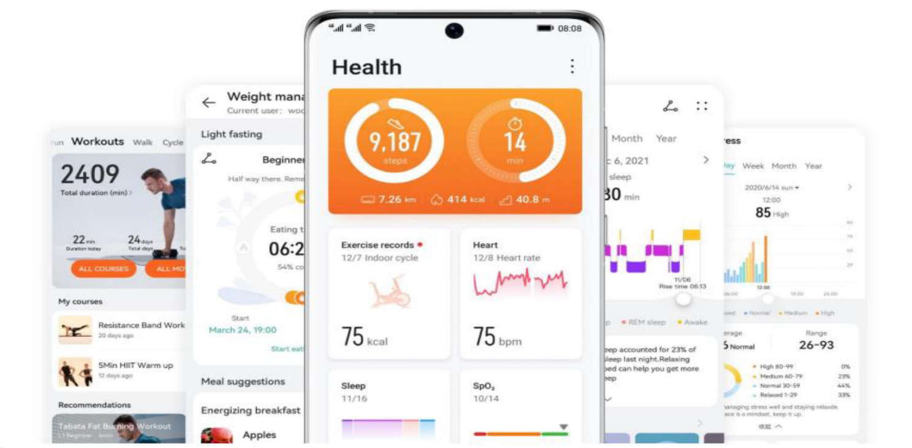

> ❗ **Note:** Note that monitored data is for personal reference only and must not be used for clinical or diagnostic purposes.

Health Service Kit grants third-party ecosystem applications access to users' health and fitness data via HUAWEI ID and explicit user authorization. It connects apps, services, and hardware devices to build a unified smart health and fitness ecosystem. The platform integrates with Huawei's own applications, including the Huawei Health app for workout and health management, and the AI Life app for smart IoT device management, as well as ecosystem apps in fields such as sports, medical research, and insurance. Health Service Kit offers basic capabilities covering atomic health data such as step count, heart rate, and sleep, alongside extended capabilities for real-time data, including live workout metrics. It also provides device access for third-party hardware via Gym Profile and Wellness Profile, both built on standard Bluetooth protocols, and a cloud-based data center for storing health and fitness data. All data is protected through user-level keys and chip-level encryption, with hierarchical data categorization, isolated app scope management, and a blocklist for malicious applications. Users retain full control via proactive authorization and the ability to revoke access at any time. The platform complies with global privacy regulations, including the EU [GDPR](https://consumer.huawei.com/minisite/cloudservice/health/privacy-statement.htm?code=HK&language=en_us)(General Data Protection Regulation), applying full lifecycle management for personal data in line with GAPP best practices.

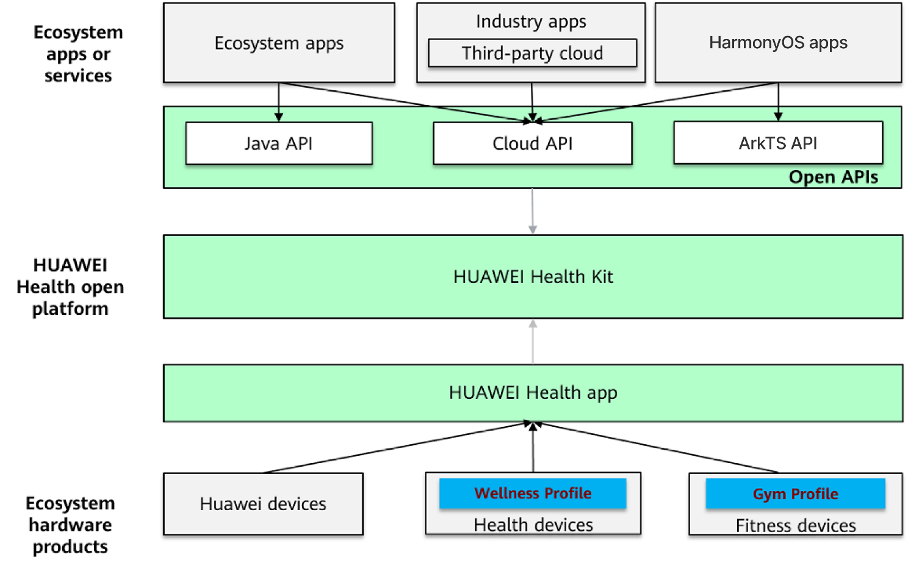

# Executive Summary

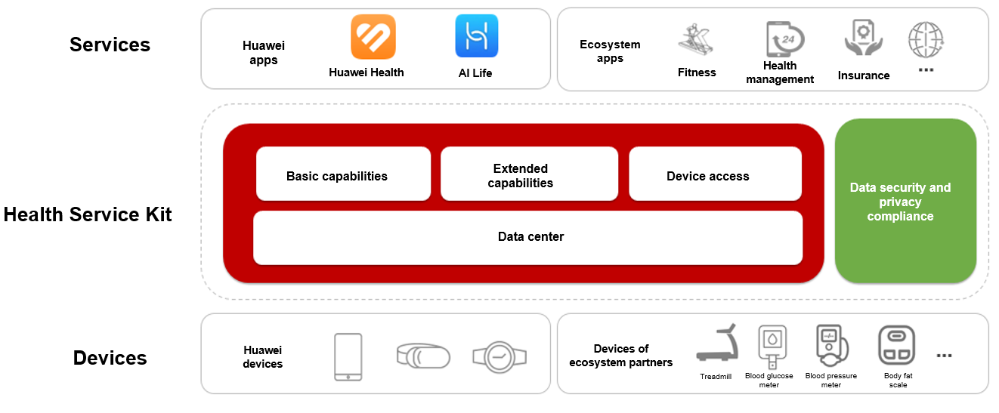

Huawei Health Kit provides APIs and SDKs for developing health-related applications across multiple platforms, including *HarmonyOS, Android, iOS*, and the *Huawei Mobile Services (HMS) ecosystem*. Additionally, it provides support via dedicated plugins for popular [frameworks](https://developer.huawei.com/consumer/en/doc/HMS-Plugin-Guides-V1/reactnative-0000001050157753-V1) such as *React Native, Flutter, Xamarin, and Cordova.* It can be integrated using either the On-Device SDK, which runs locally on Android and HarmonyOS devices and enables access to real-time data and device-level capabilities, or the Cloud-Side API (REST API), which operates through Huawei Cloud, is platform-independent, and is suitable for server-to-server scenarios. While the On-Device SDK supports real-time and device-specific features, the Cloud-Side API provides access to health data synchronized with Huawei Cloud. Health data is securely transmitted, encrypted, and managed according to Huawei's [privacy](https://consumer.huawei.com/minisite/cloudservice/health/privacy-statement.htm?code=HK&language=en_us) and data protection policies, including GDPR requirements where applicable. In addition, developers must obtain Huawei's approval before accessing and using Health Kit services.

## Access Methods

### Cloud-side (REST API)

- On the cloud side, it provides access to health and fitness data stored on the server through a REST API, enabling developers to seamlessly retrieve, manage, and analyze user information in a secure and scalable manner.

- The data can be synchronized across different applications, allowing for the creation of a centralized data platform that ensures consistency, enhances accessibility, and enables comprehensive insights across the entire ecosystem.

- Supported platforms: Both web apps and mobile apps (Android, iOS, HarmonyOS)

### On-Device SDK

#### Android (Java/Kotlin)

- **Basic Capabilities:** This includes reading and managing exercise records, health data, and other fitness-related information. Through the APIs, developers can add, delete, modify, and query data as needed. All changes are automatically synchronized between the device and the server, ensuring that users always have up-to-date information across multiple platforms and devices.

- **Extended Capabilities:** It provides access to **real-time** health and fitness data, making it suitable for applications or scenarios that require instant updates. This capability allows developers to build responsive, dynamic experiences where users can monitor their performance, track vital signs, or receive timely feedback as activities occur.

#### HarmonyOS

- The HarmonyOS platform is supported on HarmonyOS 5 devices through the ARKTS Health Kit SDK. This enables developers to leverage the latest tools and features of the HarmonyOS ecosystem, facilitating advanced health and fitness application development with improved performance, seamless integration, and enhanced user experience.

> **SDK Features:**

- Comprehensive access to health and fitness data, allowing developers to retrieve, analyze, and manage a wide range of user information. This broad access supports the creation of feature-rich applications that can track wellness, monitor physical activity, and deliver personalized insights effectively.

- Support for integration with third-party devices, enabling seamless connectivity and data exchange between different hardware and the platform. This capability allows developers to expand the ecosystem, incorporate additional sensors, and provide users with a more comprehensive and unified health and fitness experience.

- It provides a comprehensive data platform for storing and managing professional health and fitness data. This platform enables secure, organized, and scalable handling of detailed user information, allowing developers and healthcare providers to efficiently track, analyze, and optimize health and fitness outcomes.

## 2.2 Key Differences Between Health Service Kit Types

The choice between a cloud solution and an on-device SDK largely depends on the platform and usage requirements. Cloud solutions are platform-independent, accessible from web and mobile devices, and can retrieve up-to-date data whenever the access token is valid. On the other hand, on-device SDKs are platform-dependent, working only on specific devices like Android or HarmonyOS, and can access data only while the app or background service is running. This fundamental difference in dependency and accessibility often guides the decision on which approach to use.

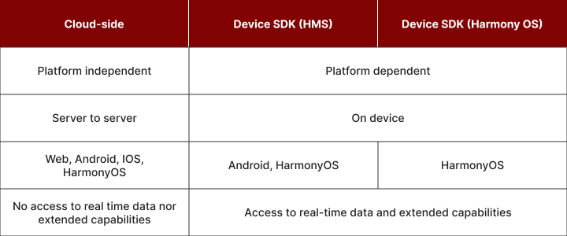

In terms of details, cloud solutions require developers to handle authorization and access token regeneration manually and operate server-to-server. Device SDKs, however, manage authorization and token renewal automatically in the background and provide access to real-time data and extended capabilities. Choosing between them comes down to the trade-off each developer is willing to make: cloud solutions offer broad reach with more manual auth handling, while device SDKs offer **real-time** data and richer capabilities with authorization managed for you. The developer should make the choice based on the specific needs of their integration.

# Core Architecture of Health Kit

##  Introduction to Health Kit Architecture

- **Main architecture of the cloud side;**

When the user logs in to Huawei ID, you can obtain an **access token (AT)**. You can use a **refresh token (RT)** if the access token expires. Then, you can access health data with this access token.

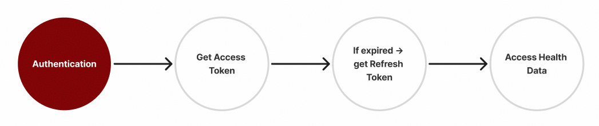

- **Main architecture of the SDK (Android);**

When the user logs in to Huawei ID and enables Huawei Health in the Huawei Health app, you can access health data.

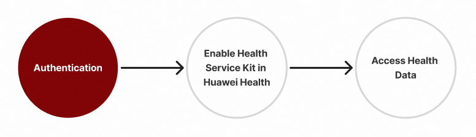

- **Main architecture of the SDK (HarmonyOS);**

For Lite wearable devices **6.1.1 (24)**, you can integrate the workout service.

> ❗ **Note:** For smart wearable devices, you can read health data, but this feature is available only in China. The workout service solution will be supported in the **future versions** for smart devices.

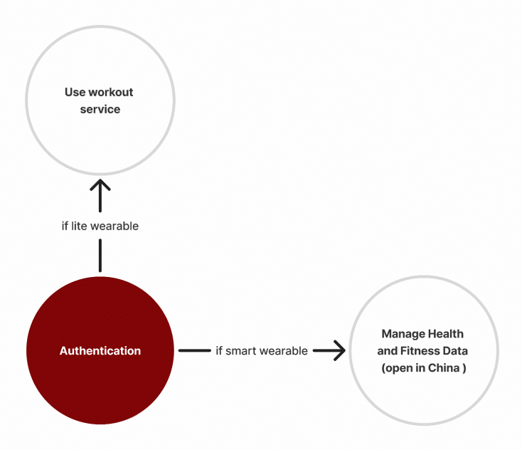

##  Data Openness

You can examine which health data is accessible and which is not, for which scenario, in the tables below. The openness level column  indicates advanced data that is ***not open to individual developers*** and  indicates data that is open to **both individual and enterprise developers.**

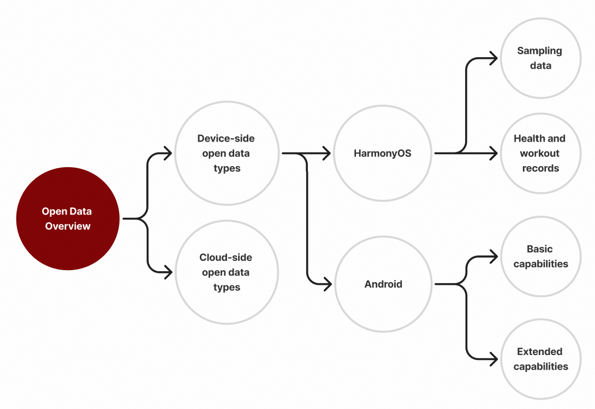

##  Cloud-Side Open Data Types

REST APIs support cross-platform development to ensure a consistent experience on different platforms and improve the efficiency of development.

| **Category**     | **Sub-Category**                                                                                                                                | **Openness Level**                                                         | **Data Timeliness** | **Read Supported** | **Write Supported** |
|------------------|-------------------------------------------------------------------------------------------------------------------------------------------------|----------------------------------------------------------------------------|---------------------|--------------------|---------------------|
| Daily activity   | [Steps](https://developer.huawei.com/consumer/en/doc/HMSCore-Guides/steps-0000001177343435)                                              |  | In hours            | Yes                | Yes                 |
|                  | [Calories](https://developer.huawei.com/consumer/en/doc/HMSCore-Guides/calories-0000001177343441)                                        |  | In hours            | Yes                | Yes                 |
|                  | [Distance](https://developer.huawei.com/consumer/en/doc/HMSCore-Guides/distance-0000001131264000)                                        |  | In hours            | Yes                | Yes                 |
|                  | [Altitude](https://developer.huawei.com/consumer/en/doc/HMSCore-Guides/altitude-0000001177343443)                                        |  | In hours            | Yes                | Yes                 |
|                  | [Moderate to high intensity](https://developer.huawei.com/consumer/en/doc/HMSCore-Guides/middle-high-intensity-0000001131264002)         |  | In hours            | Yes                | Yes                 |
|                  | [Hours active](https://developer.huawei.com/consumer/en/doc/HMSCore-Guides/activehours-0000001521403798)                                 |  | In hours            | Yes                | Yes                 |
|                  | [Daily activity data](https://developer.huawei.com/consumer/en/doc/HMSCore-Guides/dailyactivitysummary-0000001572243693)                 |  | In hours            | Yes                | No                  |
| Health data      | [Height](https://developer.huawei.com/consumer/en/doc/HMSCore-Guides/height-0000001131263998)                                            |   | In minutes          | Yes                | Yes                 |
|                  | [Weight](https://developer.huawei.com/consumer/en/doc/HMSCore-Guides/weight-0000001131423772)                                            |   | In minutes          | Yes                | Yes                 |
|                  | [Heart rate](https://developer.huawei.com/consumer/en/doc/HMSCore-Guides/heart-rate-0000001131423780)                                    |   | In hours            | Yes                | Yes                 |
|                  | [Stress](https://developer.huawei.com/consumer/en/doc/HMSCore-Guides/stress-0000001177423529)                                            |   | In hours            | Yes                | Yes                 |
|                  | [Sleep](https://developer.huawei.com/consumer/en/doc/HMSCore-Guides/sleep-0000001131264006)                                              |   | In minutes          | Yes                | Yes                 |
|                  | [Blood glucose](https://developer.huawei.com/consumer/en/doc/HMSCore-Guides/blood-glucose-0000001177423531)                              |   | In minutes          | Yes                | Yes                 |
|                  | [Blood pressure](https://developer.huawei.com/consumer/en/doc/HMSCore-Guides/blood-pressure-0000001177343449)                            |   | In minutes          | Yes                | Yes                 |
|                  | [SpO2](https://developer.huawei.com/consumer/en/doc/HMSCore-Guides/blood-oxygen-0000001131264010)                                        |   | In hours            | Yes                | Yes                 |
|                  | [Body temperature](https://developer.huawei.com/consumer/en/doc/HMSCore-Guides/body-temperature-0000001177423533)                        |   | In minutes          | Yes                | Yes                 |
|                  | Heart health                                                                                                                                    |   | In minutes          | Yes                | Yes                 |
|                  | Lung function                                                                                                                                   |   | In minutes          | Yes                | No                  |
|                  | [Reproductive health](https://developer.huawei.com/consumer/en/doc/HMSCore-Guides/menstrual-cycle-0000001207140290)                      |   | In hours            | Yes                | Yes                 |
| Exercise records | [Exercise record summary](https://developer.huawei.com/consumer/en/doc/HMSCore-Guides/introduction-fitness-record-data-0000001131831088) |  | In minutes          | Yes                | Yes                 |
|                  | [Exercise record detailed data](https://developer.huawei.com/consumer/en/doc/HMSCore-Guides/introduction-0000001326553313)               |  | In minutes          | Yes                | Yes                 |
|                  | [Activity record location details](https://developer.huawei.com/consumer/en/doc/HMSCore-Guides/location-0000001177423525)                |  | In minutes          | Yes                | Yes                 |
| Historical data  | [Historical data](https://developer.huawei.com/consumer/en/doc/HMSCore-Guides/historydata-open-0000001209921350)                         |  | N/A                 | Yes                | No                  |

##  Device-Side Open Data Types

### For Basic Capabilities

The basic capabilities of the Health Service Kit open up a range of basic atomic health and fitness data, including step count, heart rate, and sleep.

| **Category**     | **Sub-Category**                                                                                                                        | **Openness Level**                                                         | **Data Timeliness** | **Read Supported** | **Write Supported** |
|------------------|-----------------------------------------------------------------------------------------------------------------------------------------|----------------------------------------------------------------------------|---------------------|--------------------|---------------------|
| Daily activity   | [Steps](https://developer.huawei.com/consumer/en/doc/HMSCore-Guides/steps-0000001131417160)                                      |  | In hours            | Yes                | Yes                 |
|                  | [Calories](https://developer.huawei.com/consumer/en/doc/HMSCore-Guides/calories-0000001131417164)                                |  | In hours            | Yes                | Yes                 |
|                  | [Distance](https://developer.huawei.com/consumer/en/doc/HMSCore-Guides/distance-0000001131257380)                                |  | In hours            | Yes                | Yes                 |
|                  | [Altitude](https://developer.huawei.com/consumer/en/doc/HMSCore-Guides/altitude-0000001131417168)                                |  | In hours            | Yes                | Yes                 |
|                  | [Moderate to high intensity](https://developer.huawei.com/consumer/en/doc/HMSCore-Guides/middle-high-intensity-0000001131257384) |  | In hours            | Yes                | Yes                 |
|                  | [Weight](https://developer.huawei.com/consumer/en/doc/HMSCore-Guides/weight-0000001177416897)                                    |   | In minutes          | Yes                | Yes                 |
|                  | [Heart rate](https://developer.huawei.com/consumer/en/doc/HMSCore-Guides/heart-rate-0000001131417172)                            |   | In hours            | Yes                | Yes                 |
|                  | [Stress](https://developer.huawei.com/consumer/en/doc/HMSCore-Guides/stress-0000001131257394)                                    |   | In hours            | Yes                | Yes                 |
|                  | [Sleep](https://developer.huawei.com/consumer/en/doc/HMSCore-Guides/sleep-0000001177336827)                                      |   | In minutes          | Yes                | Yes                 |
|                  | [Blood glucose](https://developer.huawei.com/consumer/en/doc/HMSCore-Guides/blood-glucose-0000001131417182)                      |   | In minutes          | Yes                | Yes                 |
|                  | [Blood pressure](https://developer.huawei.com/consumer/en/doc/HMSCore-Guides/blood-pressure-0000001131257402)                    |   | In minutes          | Yes                | Yes                 |
|                  | [SpO2](https://developer.huawei.com/consumer/en/doc/HMSCore-Guides/blood-oxygen-0000001177416923)                                |   | In hours            | Yes                | Yes                 |
|                  | [Body temperature](https://developer.huawei.com/consumer/en/doc/HMSCore-Guides/body-temperature-0000001131417184)                |   | In hours            | Yes                | Yes                 |
|                  | Heart health                                                                                                                            |   | In minutes          | Yes                | Yes                 |
|                  | Lung function                                                                                                                           |   | In minutes          | Yes                | No                  |
| Exercise records | [Exercise record summary](https://developer.huawei.com/consumer/en/doc/HMSCore-Guides/activity-type-constants-0000001135051290)  |  | In minutes          | Yes                | Yes                 |
|                  | [Exercise record detailed data](https://developer.huawei.com/consumer/en/doc/HMSCore-Guides/introduction-0000001337415777)       |  | In minutes          | Yes                | Yes                 |
| Historical data  | [Historical data](https://developer.huawei.com/consumer/en/doc/HMSCore-Guides/historydata-open-0000001507675509)                 |  | N/A                 | Yes                | No                  |

### For Extended Capabilities

The extended capabilities open up real-time data, including real-time exercise and real-time heart rate, and provide some basic atomic data types.

| **Category**         | **Sub-Category**               | **Openness Level**                                                         | **Timeliness** | **Read Supported** | **Write Supported** |
|----------------------|--------------------------------|----------------------------------------------------------------------------|----------------|--------------------|---------------------|
| Daily activity       | Steps                          |  | In minutes     | Yes                | No                  |
|                      | Calories                       |  | In hours       | Yes                | No                  |
|                      | Distance                       |  | In hours       | Yes                | No                  |
|                      | Moderate to high intensity     |  | In hours       | Yes                | No                  |
| Health data          | Weight                         |     | In minutes     | Yes                | Yes                 |
|                      | Heart rate                     |     | In minutes     | Yes                | Yes                 |
|                      | Real-time heart data           |     | In seconds     | Yes                | No                  |
|                      | Stress                         |     | In minutes     | Yes                | No                  |
|                      | Sleep                          |     | In minutes     | Yes                | Yes                 |
|                      | SpO2                           |     | In hours       | Yes                | No                  |
|                      | Body temperature               |     | In minutes     | Yes                | No                  |
| Exercise records     | Exercise records detailed data |  | In minutes     | Yes                | No                  |
|                      | Real-time workout data         |  | In seconds     | Yes                | No                  |
| Personal information | Personal information data      |  | N/A            | Yes                | No                  |

## 

## 3.5 HarmonyOS Side Open Data Types

### 3.5.1 Sampling data

| **Sub-Category**                                                                                                 | **Openness Level**                                                         | **Data Timeliness** | **Read Supported** | **Write Supported** |     |
|------------------------------------------------------------------------------------------------------------------|----------------------------------------------------------------------------|---------------------|--------------------|---------------------|-----|
| [Daily activities](https://developer.huawei.com/consumer/en/doc/harmonyos-guides/health-daily-activities) |  | Hourly              | Y                  |                     | Y   |
| [Heart rate](https://developer.huawei.com/consumer/en/doc/harmonyos-guides/health-heart-rate)             |   | Hourly              | Y                  |                     | Y   |
| [SpO2](https://developer.huawei.com/consumer/en/doc/harmonyos-guides/health-blood-oxygen)                 |   | Hourly              | Y                  |                     | Y   |
| [Stress](https://developer.huawei.com/consumer/en/doc/harmonyos-guides/health-pressure)                   |   | Hourly              | Y                  |                     | Y   |
| [Body temperature](https://developer.huawei.com/consumer/en/doc/harmonyos-guides/health-body-temperature) |   | Minute-level        | Y                  |                     | Y   |
| [Blood pressure](https://developer.huawei.com/consumer/en/doc/harmonyos-guides/health-blood-pressure)     |   | Minute-level        | Y                  |                     | Y   |
| [Weight](https://developer.huawei.com/consumer/en/doc/harmonyos-guides/health-weight)                     |   | Minute-level        | Y                  |                     | Y   |
| [Height](https://developer.huawei.com/consumer/en/doc/harmonyos-guides/health-height)                     |   | Minute-level        | Y                  |                     | Y   |
| [Emotion](https://developer.huawei.com/consumer/en/doc/harmonyos-guides/health-emotion)                   |   | Hourly              | Y                  |                     | Y   |

### 3.5.2 Health and workout records

| **Sub-Category**                                                                                                    | **Openness Level**                                                         | **Data Timeliness** | **Read Supported** | **Write Supported** |
|---------------------------------------------------------------------------------------------------------------------|----------------------------------------------------------------------------|---------------------|--------------------|---------------------|
| [Sleep](https://developer.huawei.com/consumer/en/doc/harmonyos-guides/health-sleeprecord)                    |   | Minute-level        | Y                  | Y                   |
| [Workout](https://developer.huawei.com/consumer/en/doc/harmonyos-guides/health-exercisesequence) record data |  | Minute-level        | Y                  | Y                   |

# Integration of Health Kit

## Health Kit Application

### Health Kit Application Overview

Once development is complete and the application is functioning as expected with no outstanding integration issues, the next step is to apply for commercial verification. A **verification application** is required to remove the 100-user limit imposed during the testing phase and to obtain permanent access to the Health Service Kit. To initiate the process, prepare the required documents using the official templates provided by Huawei and submit them through the AppGallery Connect console. The verification process is conducted manually by Huawei and typically takes between 7 and 15 working days to complete.

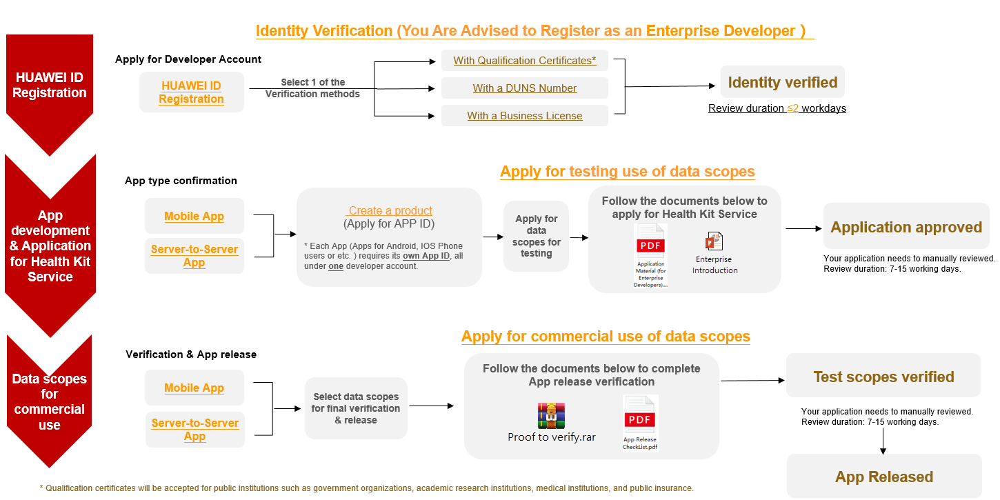

When applying for data scope access, it is essential to ensure full consistency between the scopes selected in the AppGallery Connect console and the usage scenarios described in the Excel file provided by Huawei. Selecting a scope in the console without providing a corresponding usage scenario in the Excel file, or describing a scope in the Excel file without selecting it in the console, are both considered incomplete submissions and will not be accepted during the verification review. Ensure that every scope selected in the console has a clearly documented usage scenario in the Excel file, and that no scope is described in the Excel file without being selected in the console.

### Huawei ID Registration

1.  If you don't already have an account, sign in to [HUAWEI Developers](https://developer.huawei.com/consumer/en) and click **Sign in** in the upper right corner, register one, and complete identity verification by referring to [HUAWEI ID Registration](https://developer.huawei.com/consumer/en/doc/start/registration-and-verification-0000001053628148) and [Identity Verification](https://developer.huawei.com/consumer/en/doc/start/atpopb-0000001062836624). You can register either as an individual developer or an enterprise developer.

2.  If you have a developer account, proceed to the [HUAWEI Developers](https://developer.huawei.com/consumer/en) page and click **Console** in the upper-right corner.

    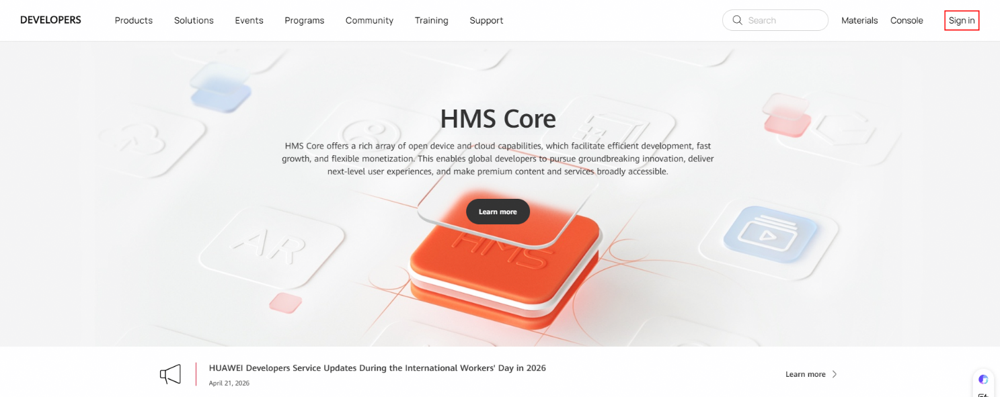

3.  Click **HUAWEI ID**.

    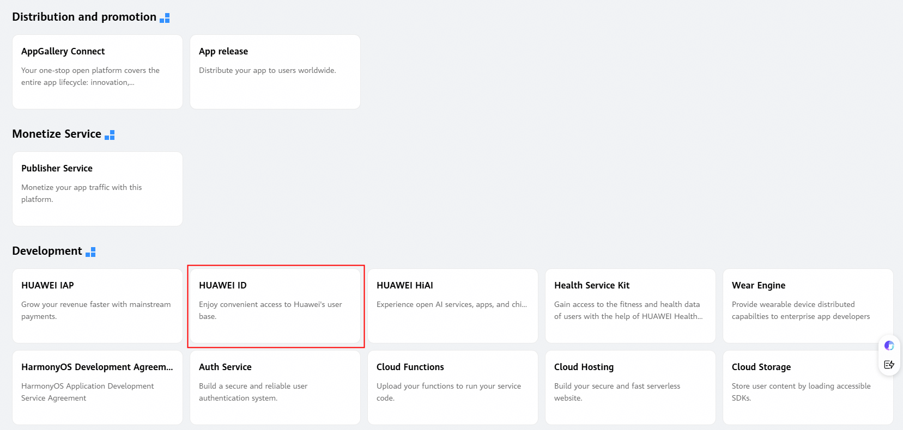

4.  Click **Apply for HUAWEI ID**, and agree to the agreement to enter the screen for product information logging.

    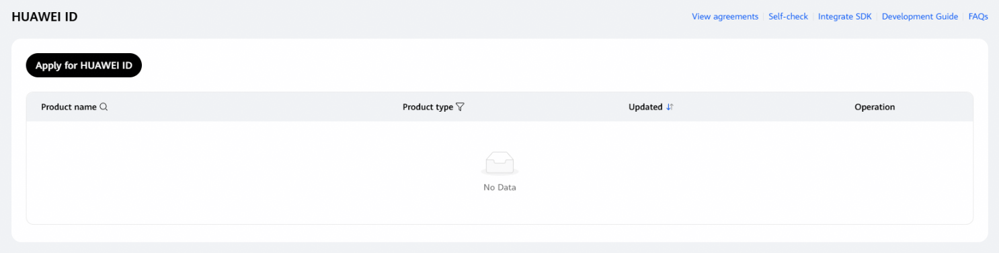

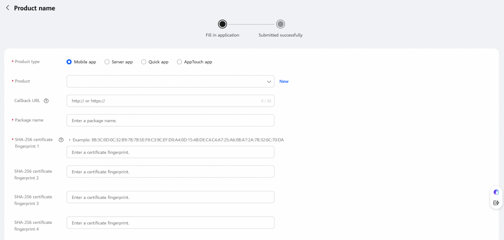

### Health Service Kit Application Form

Health Service Kit applications are divided into two categories depending on the type of developer account: individual developer and enterprise developer. The requirements for each category differ, with enterprise developer applications being considerably more extensive and therefore the primary focus of this process. To begin the application, navigate to the AppGallery Connect service console at [Huawei Developer Console App Services](https://developer.huawei.com/consumer/en/console/service/AppService) and select Health Service Kit to proceed with the relevant application form.

1.  Select **Health Service Kit**

    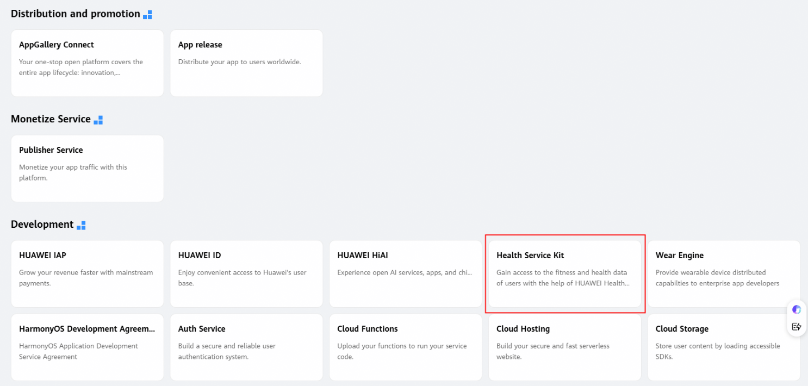

2.  Click **Apply For Health Service Kit** to proceed

    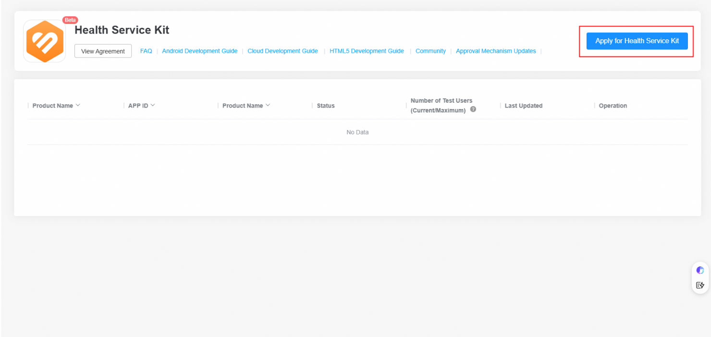

3.  Locate your application in the dropdown list and select the industry that best corresponds to your application's primary use case.

    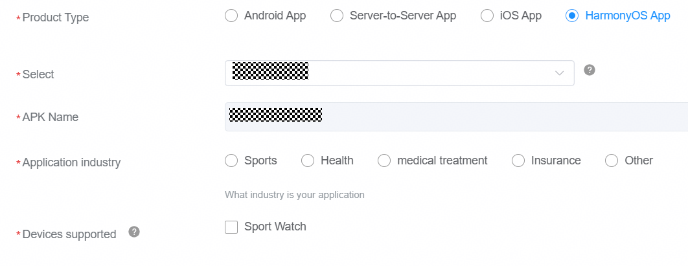

4.  Select the data scopes that your application requires access to, ensuring that each selected scope is directly relevant to your application's functionality and has a corresponding usage scenario documented in the application form.

    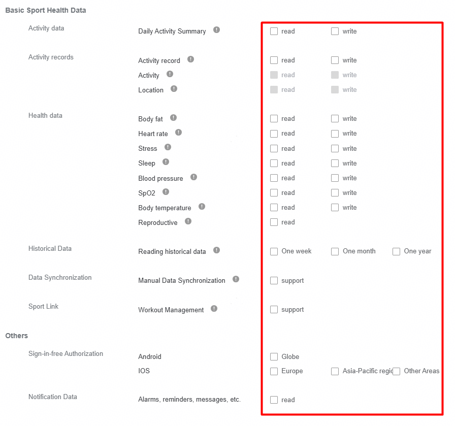

5.  Once all required data scopes have been selected, click Next and upload the completed application form ([Individual Form Link](https://hihealthbase-drcn.things.hicloud.com/healthkit/fileServer/getFile/protected/ApplicationMaterialsForIndividualDevelopers/000/001/044/1000000000000001044.20260122114556.55382993516326098483359606692230:20760110114731:100005355:0F338080DF83A2EE6EE4BBC8C4F3B920F42DC3B3C516E99AE66DE501D41B4DAD.xlsx) / [Enterprise Form Link](https://hihealthbase-drcn.things.hicloud.com/healthkit/fileServer/getFile/protected/ApplicationMaterialsForEnterpriseDevelopers/000/001/044/1000000000000001044.20260122114427.83077948166586063366623661208340:20760110114731:100005355:F4B2CDFE28CCB59A7287EDCA4DC0635DFB992D4F1E50F4478EE65AF51F917FC3.xlsx)) along with any other required supporting documents. Fill in all required fields in the application form, ensuring that any links provided, such as your application's privacy policy or website URL, are accessible from Mainland China.

    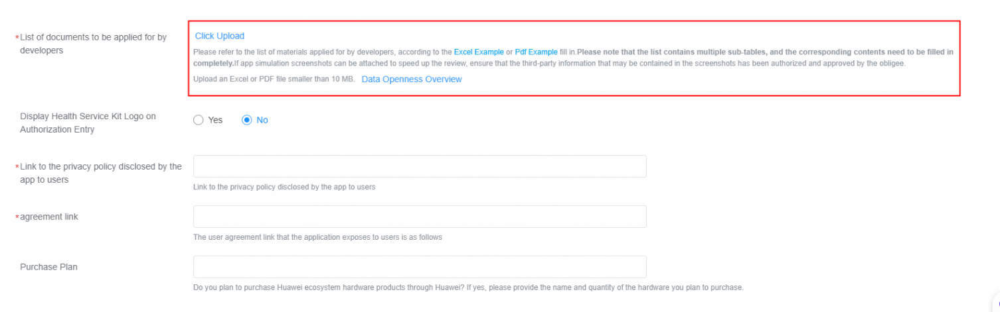

After all required fields have been completed and the necessary documents have been uploaded, click **Submit**. The application will be reviewed manually by Huawei, and the process typically takes around 15 working days to complete.

### Most Common Rejection Reasons for Health Kit Applications

1.  **Mismatch Between Selected Data Scopes and Application Form**

This error occurs when the data scopes selected in the Health Kit Huawei Developer console do not match the usage scenarios documented in the application Excel. Every scope selected in the console must have a clearly described usage scenario in the application form, and every scope described in the form must be selected in the console. Any inconsistency between the two will result in the application being rejected during the review process.

2.  **Insufficient or Unclear Usage Scenario Description in the Application Form**

This issue occurs when the usage scenarios provided in the application Excel for the selected data scopes are considered insufficient or inadequately explained by the reviewer. Each usage scenario must clearly describe why the requested data scope is necessary for the application, how the data will be used, and what value it provides to the end user. Vague or generic descriptions that do not sufficiently justify the need for a particular data scope will result in the application being rejected during the review process. It is strongly recommended to provide detailed, specific, and transparent explanations for each requested scope to ensure a successful application outcome.

##  Cloud Side Development

You can refer to [this](https://www.postman.com/trl2dtse/hms-core/collection/d43j3al/health-kit?sideView=agentMode) Postman documentation to send a request.

### Authorization

The user needs to log in to the Huawei ID account. If the user logs in to Huawei ID, the system will return an authorization code, and you need to get an access token with this authorization code. You can reach the health data with this access token. The code is obtained when a user is redirected from a browser (or the browser component in the mobile phone or desktop app) to the address [https://oauth-login.cloud.huawei.com/oauth2/v3/authorize.](https://oauth-login.cloud.huawei.com/oauth2/v3/authorize.)

The parameters required for redirection are as follows.

| **Parameter** | **Mandatory** | **Description**                                                                                                                                                                                                                                                                                                                          |
|---------------|---------------|------------------------------------------------------------------------------------------------------------------------------------------------------------------------------------------------------------------------------------------------------------------------------------------------------------------------------------------|
| client_id     | Yes           | App ID is obtained when the app is registered on HUAWEI Developers.                                                                                                                                                                                                                                                                      |
| response_type | Yes           | The value is always **code**.                                                                                                                                                                                                                                                                                                            |
| redirect_uri  | Yes           | URI to be called back after the authorization.                                                                                                                                                                                                                                                                                           |
| scope         | Yes           | Character string array separated by spaces. The spaces will be changed to plus signs (+) after URL encoding. The character string **openid** must be contained. For other information, please refer to the [OAuth Scope](https://developer.huawei.com/consumer/en/doc/HMSCore-Guides/steps-0000001177343435#section165119447225). |
| state         | No            | Random string, which is used to prevent CSRF. The value is returned without any change, along with the authorization code.                                                                                                                                                                                                               |
| display       | Yes           | The value is **page** for PCs, and **touch** for mobile devices. The default value is **page**.                                                                                                                                                                                                                                          |
| access_type   | No            | When the parameter is set to **offline**, a refresh token will be returned together with the access token in the second step.                                                                                                                                                                                                            |

**redirect_uri**: callback URL set when you apply for the HUAWEI ID service, as shown in the following figure.

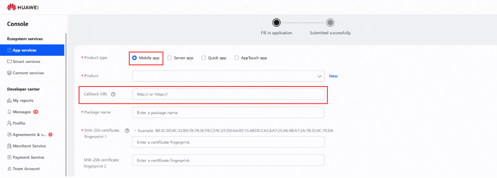

Example;

1.  The user can log in to the Huawei ID account with this link.

```text
https://oauth-login.cloud.huawei.com/oauth2/v3/authorize?response_type=code&state=state_parameter_passthrough_value&client_id=123456789&redirect_uri=https%3A%2F%2Fwww.example.com&scope=openid+https://www.huawei.com/healthkit/step.read+https://www.huawei.com/healthkit/activityrecord.read+https://www.huawei.com/healthkit/activity.read+https://www.huawei.com/healthkit/calories.read&access_type=offline&display=touch
```

In response to the request, the screen shown on the right will be displayed after the user logs in.

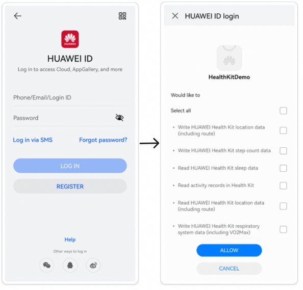

When accessing the Health Service Kit, an app is authorized using the **authorization code** based on OAuth 2.0. Then, you can generate an access token based on this authorization code. After the access token expires, use the refresh token to obtain a new access token. After the user agrees to authorize access, the authorization server redirects the user's browser to **redirect_uri** with the parameters **code** and **state** (if contained in the request for obtaining the access token).

1.  Use the authorization code to obtain the access token.

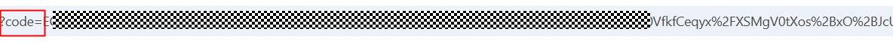

After obtaining the authorization code in the previous step, it can be used to generate an access token by sending a request using the POST method from the app's server to the Huawei OAuth 2.0 authorization service address [https://oauth-login.cloud.huawei.com/oauth2/v3/token](https://oauth-login.cloud.huawei.com/oauth2/v3/token) with the following input parameters:

| **Parameter** | **Mandatory** | **Description**                                                                                                                                             |
|---------------|---------------|-------------------------------------------------------------------------------------------------------------------------------------------------------------|
| grant_type    | Yes           | The value is always **authorization_code**.                                                                                                                 |
| code          | Yes           | The authorization code was obtained in the first step. The code expires in five minutes and can be used only once.                                          |
| client_id     | Yes           | App ID.                                                                                                                                                     |
| client_secret | Yes           | The secret key of the app, which can be viewed on HUAWEI Developers.                                                                                        |
| redirect_uri  | Yes           | The value must be the same as the value of **redirect_uri** (callback URL you filled in when registering your app) passed to obtain the authorization code. |

**Request example:**

```http
POST /oauth2/v3/token HTTP/1.1
Host: oauth-login.cloud.huawei.com
Content-Type: application/x-www-form-urlencoded
grant_type=authorization_code&code=YOUR_CODE&redirect_uri=http%3A%2F%2Fwww.example.com
```

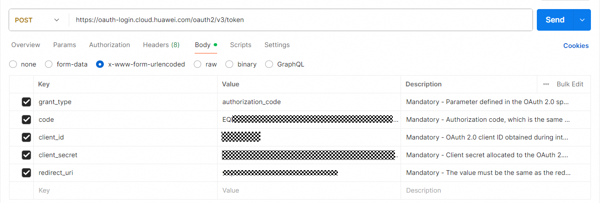

If the parameters are correct, the server returns the JSON text. The following table describes the parameters in a response body.

| **Parameter** | **Mandatory** | **Description**                                                                                                                                                                                                                                                                                                       |
|---------------|---------------|-----------------------------------------------------------------------------------------------------------------------------------------------------------------------------------------------------------------------------------------------------------------------------------------------------------------------|
| access_token  | Yes           | Access token to be obtained.                                                                                                                                                                                                                                                                                          |
| expires_in    | Yes           | Validity period of the access token (unit: seconds).                                                                                                                                                                                                                                                                  |
| scope         | Yes           | Scope contained in the access token generated.                                                                                                                                                                                                                                                                        |
| token_type    | Yes           | This value is always **Bearer**, indicating the type of the returned access token.                                                                                                                                                                                                                                    |
| id_token      | Yes           | [ID token in JWT format](https://jwt.io/introduction/), including user information such as the account and email address.                                                                                                                                                                                      |
| refresh_token | No            | The value of this parameter is returned if **access_type=offline** is contained in the input parameter in [Step 1](https://developer.huawei.com/consumer/en/doc/HMSCore-Guides/auth-example-0000001054581058#EN-US_TOPIC_0000002516518878__li1118518134711). This parameter is used to update an access token. |

**Response example:**

```http
HTTP / 1.1 200 OK
Content - Type: application / json
Cache - Control: no - store
{
"access_token": ACCESS_TOKEN
"expires_in": 3600,
"id_token": ID_TOKEN,
"refresh_token": YOUR_REFRESH_TOKEN
"scope": "https://www.huawei.com/healthkit/heightweight.read https://www.huawei.com/healthkit/calories.read",
"token_type": "Bearer"
}
```

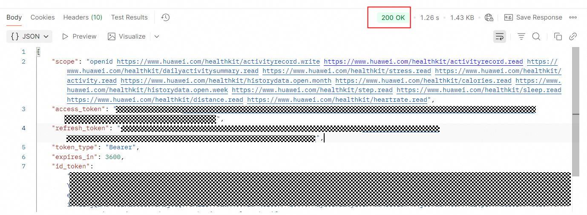

1.  Obtain the access token using a refresh token.  
    A refresh token can be used to obtain a new access token by sending a request using the POST method from the app's server to the Huawei OAuth 2.0 authorization service address [https://oauth-login.cloud.huawei.com/oauth2/v3/token](https://oauth-login.cloud.huawei.com/oauth2/v3/token) with the following input parameters:

| **Parameter** | **Mandatory** | **Description**                                                      |
|---------------|---------------|----------------------------------------------------------------------|
| grant_type    | Yes           | The value is always **refresh_token**.                               |
| refresh_token | Yes           | Refresh token for the access token.                                  |
| client_id     | Yes           | App ID.                                                              |
| client_secret | Yes           | The secret key of the app, which can be viewed on HUAWEI Developers. |

**Request example:**

```http
POST /oauth2/v3/token HTTP/1.1
Host: oauth-login.cloud.huawei.com
Content-Type: application/x-www-form-urlencoded
grant_type=refresh_token&client_id=123456789&client_secret=YOUR_CLIENT_SECRET
```

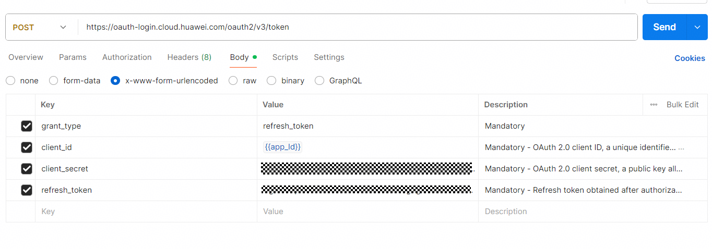

If the parameters are correct, the server returns the JSON text. The following table describes the parameters in a response body.

| **Parameter** | **Description**                                      |
|---------------|------------------------------------------------------|
| access_token  | Access token to be obtained.                         |
| expires_in    | Validity period of the access token (unit: seconds). |
| scope         | List of scopes granted by the user.                  |
| token_type    | Token type. The value is currently Bearer.           |

**Response example:**

```http
HTTP / 1.1 200 OK
Content - Type: application / json
Cache - Control: no - store
{
"access_token": YOUR_ACCESS_TOKEN,
"expires_in": 3600,
"scope": "https://www.huawei.com/healthkit/heightweight.read https://www.huawei.com/healthkit/calories.read",
"token_type": " Bearer"
}
```

**Refresh Token Authorization Management**

The refresh token and access token cannot be replaced with each other. The validity period of the refresh token is **180 days.** Within the validity period, the app can directly call the [**https://oauth-login.cloud.huawei.com/oauth2/v3/token**](https://oauth-login.cloud.huawei.com/oauth2/v3/token) API of the OAuth service through the refresh token to obtain a new access token. In this way, your app does not need to display the authorization page again to ask for sign-in authorization from the user. The refresh token expires immediately if any of the following situations happen: password change, account freeze, account change or deletion, account deregistration, device deletion due to the number limit or by the user, exit from the phone client APK (device), exit from the current browser, or exit from all browsers.

**Access health data**

After you get an access token, you can access the health scope that you want. There are 3 data types: [Atomic Sampling Data](https://developer.huawei.com/consumer/en/doc/HMSCore-Guides/atomic-sampling-data-types-0000001325175809), [Exercise Records](https://developer.huawei.com/consumer/en/doc/HMSCore-Guides/activity-record-data-0000001135211086), and [Health Record](https://developer.huawei.com/consumer/en/doc/HMSCore-Guides/health-record-data-0000001181170619).

You can check the endpoint and request body for your health data.

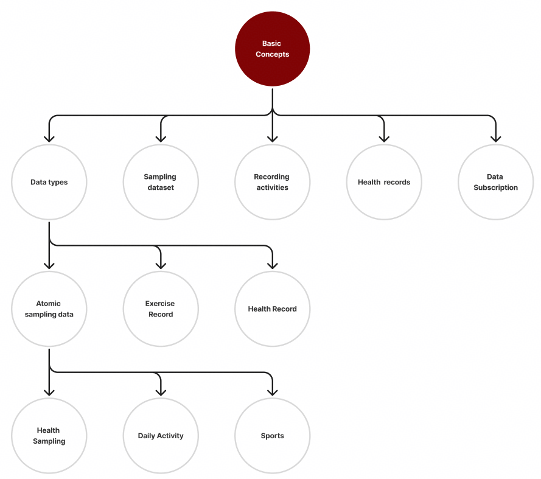

### Sampling Datasets

- **[Querying the Historical Records of Sampling Data](https://developer.huawei.com/consumer/en/doc/HMSCore-References/datacollectors_samplesets_history-0000001050116809#section14230128194710):** Queries the historical records of sampling data of a specified data collector.

<!-- -->

- **[Uploading Sampling Data](https://developer.huawei.com/consumer/en/doc/HMSCore-References/datacollectors_samplesets_patch-0000001050114858):** Uploads the sampling data collected by the data collector.

- **[Querying Sampling Datasets Within a Duration](https://developer.huawei.com/consumer/en/doc/HMSCore-References/datacollectors_samplesets_get-0000001050116811):** Queries sampling datasets within a specified duration.

- **[Deleting Sampling Datasets Within a Duration](https://developer.huawei.com/consumer/en/doc/HMSCore-References/datacollectors_samplesets_delete-0000001050114860):** Deletes sampling datasets of a specified duration.

- **[Querying Sampling Data Details](https://developer.huawei.com/consumer/en/doc/HMSCore-References/sampleset_polymerize_detailed-0000001050114864):** Obtains the sampling data details of a specific data type or data collector for a specified time range.

- **[Querying Sampling Data Statistics](https://developer.huawei.com/consumer/en/doc/HMSCore-References/sampleset_polymerize_aggregated-0000001176294110):** Polymerizes data of a specified data type or data collector using the specified rules.

- **[Querying Sampling Data Statistics of Multiple Days](https://developer.huawei.com/consumer/en/doc/HMSCore-References/sampleset_daily_polymerize-0000001078113560):** Polymerizes and queries data of a specific type by day using the specified rules.

- **[Querying the Latest Sampling Data](https://developer.huawei.com/consumer/en/doc/HMSCore-References/latest-sampleset-0000001078273166):** Queries the latest sampling data point of a specified data type.

### Recording Activities

- **[Creating/Updating an Activity Record](https://developer.huawei.com/consumer/en/doc/HMSCore-References/activityrecords_update-0000001050116813):** Creates or updates an activity record and writes Exercise and Move data into Activity Rings.

<!-- -->

- **[Querying Created Exercise Records](https://developer.huawei.com/consumer/en/doc/HMSCore-References/activityrecords_list-0000001050114862):** Queries **ActivityRecords** that have been created by a user.

- **[Querying Activity Goals](https://developer.huawei.com/consumer/en/doc/HMSCore-References/query-sports-target-0000001657230865):** Queries the activity goals set by a user. Currently, the available goals include the number of steps, calories consumed, activity duration, and hours active.

- **[Deleting an Activity Record](https://developer.huawei.com/consumer/en/doc/HMSCore-References/activityrecords_delete-0000001050116815):** Deletes a specified activity record.

- **[Deleting all Activity Records](https://developer.huawei.com/consumer/en/doc/HMSCore-References/delete-ac-rec-by-clientid-0000001063007930):** Delete all activity records of the current app.

### Deleting Data and Canceling Authorization

- **[Querying the Privacy Authorization Status](https://developer.huawei.com/consumer/en/doc/HMSCore-References/get-privacy-records-0000001058868980):** Queries the privacy authorization for the Health Service Kit in the Huawei Health app.

- **[Deleting All Data Collectors and Sampling Datasets by Data Type](https://developer.huawei.com/consumer/en/doc/HMSCore-References/deleteall-by-datatype-clientid-0000001063167930):** Deletes all data created by the app based on data types.

- **[Querying the Scopes Granted to an App](https://developer.huawei.com/consumer/en/doc/HMSCore-References/get-scopes-0000001059712559):** Queries the scopes that the user has granted to an app.

- **[Canceling Authorization Granted to an App](https://developer.huawei.com/consumer/en/doc/HMSCore-References/cancel-scpoes-0000001059462192):** Cancels all scopes that the user has granted to an app.

### Data Subscription

The Health Service Kit cloud provides a subscription mechanism that notifies your app of user data changes in real time, ensuring that your app can always obtain the latest data.

> ❗ **Note:** Individual accounts do not support.

Your app will be notified of user data changes in real time. In this way, the user data of your app is always up to date. The procedure is as follows:

1.  You need to [register as a subscriber](https://developer.huawei.com/consumer/en/doc/HMSCore-Guides/subscription-0000001078496860#section4351143591116) on the Health Service Kit management page on HUAWEI Developers.

2.  The Health Service Kit server stores the app subscriber information.

3.  Your app integrates with Health Service Kit, subscribes to events, and generates subscription records.

4.  Subscription records for users are stored in the Health Service Kit server.

5.  Your app is notified of any user data change in real time.

6.  Your app receives the notification and obtains the latest data from the Health Service Kit server.

Please follow the links below to get detailed information about the subscription mechanism;

- **[Adding/Updating a Subscription Record](https://developer.huawei.com/consumer/en/doc/HMSCore-References/subscriber-records-0000001088575341):** Adds or updates a subscription record.

- **[Deleting a Subscription Record](https://developer.huawei.com/consumer/en/doc/HMSCore-References/subscriber-records-delete-0000001088889043):** Deletes a subscription record.

- **[Deleting Subscription Records by Condition](https://developer.huawei.com/consumer/en/doc/HMSCore-References/subscriber-records-condition-delete-0000001076749758):** Deletes subscription records by condition.

- **[Querying Subscription Records](https://developer.huawei.com/consumer/en/doc/HMSCore-References/subscriber-records-list-0000001088432141):** Queries subscription records.

- **[Querying Scenario-Based Event Results](https://developer.huawei.com/consumer/en/doc/HMSCore-References/event-notifications-0000001283100022):** Queries the goal achievement result corresponding to a scenario-based event subscription record.

- **[Subscribing to Event Notifications](https://developer.huawei.com/consumer/en/doc/HMSCore-References/subscriber-event-0000001076878214):** Sends a notification for changes to a user event.

### Common Problems

1.  **403: Insufficient Permission: The request had insufficient authentication scopes**

This error occurs when the access token does not have the required permissions (scopes) for the requested Health Kit operation. This may happen if the necessary scopes were not requested during authorization, the user has revoked access, or the token was generated under a different HUAWEI ID or application. To resolve the issue, ensure all required scopes are requested and prompt the user to re-authorize if necessary.

2.  **403-121001: Request forbidden due to site cross.**

This is caused by cross-domain requests. For example, a user in Europe will encounter this error when trying to access data from the Chinese mainland.

```json
{
"error": {
"code": 121001,
"message": "request forbidden due to site cross"
}
}
```

**Solution**: Use the **Location** field in the response header

3.  **Empty data returned even when there is data visible in the Huawei Health App.**

This error occurs when the application's data has not been synced with Huawei Cloud, meaning the Health Service Kit platform cannot access data that has not yet been uploaded from the device.

The most common way to resolve this issue is to manually sync your data with Huawei Cloud. To do this, open the Huawei Health application, navigate to **Me \> Settings \> Sync** data manually, and tap the Sync button. Once the sync is complete, retry your request. If the issue persists after syncing, verify that the Huawei Health application has been authorized to share data with Health Service Kit. Open the Huawei Health application, go to **Me \> Privacy Management**, and ensure that the HUAWEI Health Kit toggle is enabled. Without this setting active, Health Service Kit will not be able to retrieve data from the Huawei Health application, regardless of the authorization scopes granted.

4.  **400: Bad Request: Invalid Argument**

This error occurs when one or more parameters in your API request are of the incorrect type, improperly formatted, or unsupported by the endpoint being called. The Health Service Kit platform strictly validates all incoming request parameters, and any mismatch between the provided values and the expected types will cause the request to be rejected. To resolve this issue, carefully review the parameters included in your request and verify that each one matches the type and format specified in the official Health Service Kit documentation for that particular endpoint.

5.  **403: The query time is out of range.**

You are only allowed to query data generated **after user authorization**. For example, if a user authorizes your app on February 14, 2022, data generated before February 14, 2022, will be unavailable to your app. If the query time is earlier than the available time range, the query fails, and error code 403 is returned. If you want to access the [historical](https://developer.huawei.com/consumer/en/doc/HMSCore-Guides/historydata-open-0000001209921350) data, then you need to apply for it.

```json
{
"error": {
"code": 403,
"message": "The query time is out of range."
}
}
```

##  HarmonyOS Development

> ❗ **Note:** The Lite edition of this kit is available to all developers worldwide. The Smart edition, however, is currently limited to the Chinese mainland (excluding Hong Kong, Macao, and Taiwan), with broader regional availability planned for a future release. For the full list of supported countries and regions, see .

### Main Structure of HarmonyOS Health Kit SDK

HarmonyOS Health Kit offers a comprehensive platform that enables ecosystem apps to seamlessly access users' health and fitness data, leveraging HUAWEI ID-based authentication and authorization. Built around a structure similar to cloud development architecture, it is designed to provide developers with a smooth and straightforward integration experience.

The development process consists of three core stages: Authorization, Data Source Operations (mobile only), and Data Operations. Through an authorized account, all necessary interactions with health data are carried out in a secure and controlled manner.

### Development for Smart Wearables

Unlike the development method of the cloud side, in HarmonyOS, the developer will be able to control all authorization states only using the functions provided by the kit. First, we need to initialize the kit to be able to use all the functions it possesses. We will import healthStore from HealthServiceKit to use everything we need to. Some of the methods will need context to intent UI, so we need a Context. The developer can use a parameter or use a global context object based on their desire.

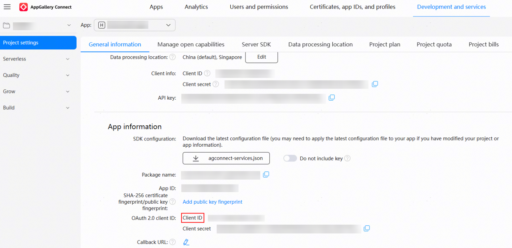

> ❗ **Note:** Before everything, you need to configure the Client ID

```typescript
import { healthStore } from '@kit.HealthServiceKit';
export async function kitInitialize(context: UIContext) {
try {
await healthStore.init(context.getHostContext());
console.info('healthSDK', 'Succeeded in initializing.');
} catch (err) {
console.error('healthSDK', `Failed to init. Code: ${err.code}, message: ${err.message}`);
}
}
```

After we get a success message, we are ready to request permissions from the user. To do this, we need to assign an AuthorizationRequest object. In this, we will add the needed data types to read and write arrays. [All sampling data types can be accessed here](https://developer.huawei.com/consumer/en/doc/harmonyos-references/health-api-samplepointhelper#modules-to-import).

```typescript
export async function kitRequestAuth(context: UIContext) {
const authorizationParameter: healthStore.AuthorizationRequest = {
readDataTypes: [healthStore.samplePointHelper.heartRate.DATA_TYPE, healthStore.samplePointHelper.bloodPressure.DATA_TYPE, healthStore.samplePointHelper.heartRateVariability.DATA_TYPE],
writeDataTypes: [healthStore.samplePointHelper.bloodPressure.DATA_TYPE]
};
try {
let authorizationResponse = await healthStore.requestAuthorizations(context, authorizationParameter);
console.info('healthPermission', 'Succeeded in requesting authorization.');
authorizationResponse.writeDataTypes.forEach(dataType => {
console.info('healthPermission', `grantedWriteDataType is : ${dataType.name}`);
});
authorizationResponse.readDataTypes.forEach(dataType => {
console.info('healthPermission', `grantedReadDataTypes is : ${dataType.name}`);
});
} catch (err) {
console.error('healthPermission', `Failed to request authorization. Code: ${err.code}, message: ${err.message}`);
}
}
```

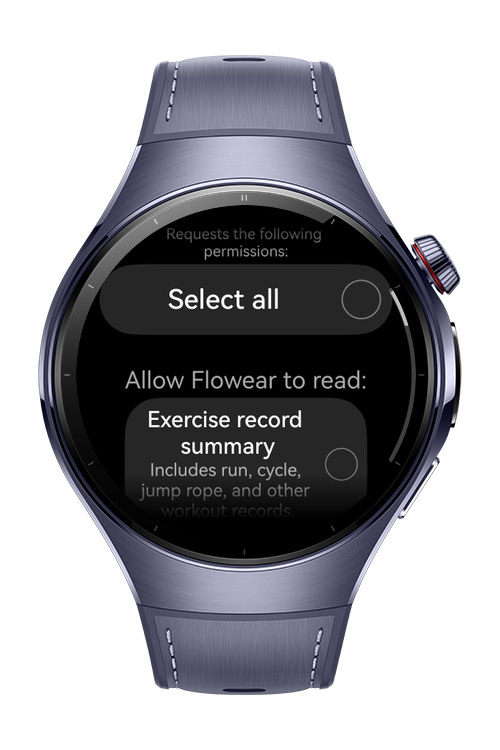

If the request is completed without any problem, the developer can access every other method. After one of the meain method cluster is the data source, these manage device sources. It allows adding data source devices more than once. It can be a watch, phone, band, scale, rope, and more. For all of the list of device categories and usage of features, you can visit the [official documentation](https://developer.huawei.com/consumer/en/doc/harmonyos-references/health-api-healthstore#devicecategory).

> ❕ **Note:** Calling data source methods on a wearable device will give the 1002700001 error code. If you use Health Kit on a wearable and need only access the data from the worn wearable watch, you can directly call the readData method. Before calling the method, you need to create a SamplePointReadRequest object that contains the desired data types.

```typescript
let samplePointReadRequest: healthStore.SamplePointReadRequest = {
samplePointDataType: healthStore.samplePointHelper.heartRate.DATA_TYPE,
startTime: Date.now() - 300000,
endTime: Date.now(),
fields: {
bpm: 45
}
};
try {
let samplePoints = await healthStore.readData(samplePointReadRequest);
samplePoints.forEach((samplePoint) => {
console.info('healthSDK', `Succeeded in reading data, the heartRate is ${samplePoint.fields.bpm}.`);
});
if (samplePoints.length === 0) {
}
console.info('healthSDK', `heart rate Successed ${JSON.stringify(samplePoints, null, 2)}`);
} catch (err) {
console.error('healthSDK', `Failed to read data. Code: ${err.code}, message: ${err.message}`);
}
```

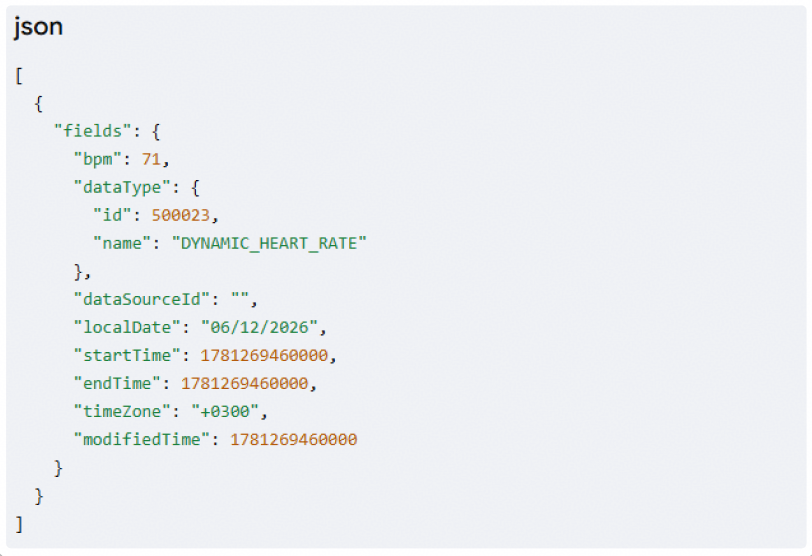

Output of Read Method on DevEco Log

Currently, the time parameters in ReadRequest do not take effect. Only the latest data on the watch can be returned. Also, the field is not mandatory. If you don't write, it will receive all of the related variables. If you want only specific variables, you can assign them a default value. Except that this field is necessary for only write methods.

In addition to reading sample point data, the developer can read the exercise and health sequences. The only difference is the type of object with its variables:

```typescript
const sequenceReadRequest: healthStore.ExerciseSequenceReadRequest<healthStore.exerciseSequenceHelper.running.DetailFields> = {
startTime: Date.now() - 300000,
endTime: Date.now(),
exerciseType: healthStore.exerciseSequenceHelper.running.EXERCISE_TYPE,
count: 1,
sortOrder: 1,
readOptions: {
withPartialDetails: ['exerciseHeartRate', 'altitude']
}
};
try {
let samplePoints = await healthStore.readData(sequenceReadRequest);
samplePoints.forEach((samplePoint) => {
console.info('healthSDK', `Succeeded in reading data, the exerciseType.name is ${samplePoint.exerciseType.name}.`);
console.info('healthSDK', `Succeeded in reading data, the heartRate is ${samplePoint.duration}.`);
});
console.info('healthSDK', `Exercise Successed ${JSON.stringify(samplePoints, null, 2)}`);
} catch (err) {
console.error('healthSDK', `Failed to read data. Code: ${err.code}, message: ${err.message}`);
}
```

### Development for Lite Wearables

On Lite Wearable devices, the Health SDK operates under a restricted permission model. Only exercise-related permissions can be requested; general data read/write permissions are not available on this platform. Once the necessary permissions are granted via requestAuthorization, the application can optionally call getAuthorization to verify the current authorization state. For data operations, only workout-specific data is accessible through saveData and readData. Beyond these, the SDK exposes a dedicated set of workout management methods that are all prefixed with workout, covering the full lifecycle of workout sessions on the device.

A detailed reference document covering Lite Wearable workout integration is currently in preparation. This section will be updated once that document is finalized.

### Common Problems

1.  **201: Authentication Failure**

This occurs when permission verification fails during the authentication process. This can stem from several causes: an incorrectly configured app fingerprint, insufficient permissions, an API that is restricted to trusted users only, or the test user limit having been reached. To resolve this, start by verifying the app's fingerprint certificate in AppGallery Connect. Refer to [Adding a Public Key Fingerprint](https://developer.huawei.com/consumer/en/doc/harmonyos-guides/application-dev-overview#conditionally-mandatory-adding-a-public-key-fingerprint) for guidance. Next, confirm that the necessary permissions have been granted to the user by consulting Managing User Authorization. If the user's test user application was unsuccessful, complete the app acceptance process through the console as outlined in Applying for Verification.

2.  **1009104001: Linking Service Enabled**

This occurs when the sports service is busy due to a workout session already being active, initiated either by the current app or another application. This typically happens when the linking service has already been started either within the same app or by a separate app running concurrently. To address this, first check whether the linking service is being enabled more than once within the same service process. Additionally, ensure that your app properly handles the scenario where the linking service has already been activated by another application, implementing appropriate exception handling to manage such conflicts gracefully.

# Security & Privacy

The Huawei Health app uses end-to-end encryption and **GDPR**-compliant privacy policies to protect your data. Your sensitive health and fitness records are processed directly on your device and securely synchronized across cloud servers.

Key points to consider to ensure the security of the application and your data:

- **Data Privacy:** You can directly manage whether or not your personal data is saved to the cloud yourself via the Internal Security - [HUAWEI Global Center.](https://consumer.huawei.com/en/privacy/built-in-security/)

- **Secure Synchronization**: Cloud-based data storage options provide an encrypted environment when you switch devices or back up your data.

- **Trusted Sources:** To avoid security vulnerabilities, you should always download the application from official sources—such as [Huawei Health](https://consumer.huawei.com/tr/mobileservices/health/) or AppGallery—and ensure it remains up to date.
