# Lite Wearable Technical Guide

## Contents

- [About This Document](#about-this-document)
  - [Abstract](#abstract)
  - [A Note on the Application Model and “Deprecated” APIs](#a-note-on-the-application-model-and-deprecated-apis)
  - [Document Structure](#document-structure)
- [1 Introduction](#1-introduction)
  - [1.1 Device Introduction](#11-device-introduction)
  - [1.2 System Capabilities](#12-system-capabilities)
    - [1.2.1 Checking Whether an API Is Available](#121-checking-whether-an-api-is-available)
  - [1.3 The FA Model](#13-the-fa-model)
  - [1.4 Web-like Development (HML / JS / CSS)](#14-web-like-development-hml--js--css)
    - [1.4.1 File Roles](#141-file-roles)
    - [1.4.2 File Access Rules](#142-file-access-rules)
    - [1.4.3 Supported Image Formats](#143-supported-image-formats)
  - [1.5 Limitations](#15-limitations)
  - [1.6 Lifecycle and Background Limitation](#16-lifecycle-and-background-limitation)
    - [1.6.1 Application Lifecycle](#161-application-lifecycle)
    - [1.6.2 Page Lifecycle](#162-page-lifecycle)
    - [1.6.3 Background Limitation](#163-background-limitation)
- [2 Pre-Development](#2-pre-development)
  - [2.1 Opening and Verifying a Developer Account](#21-opening-and-verifying-a-developer-account)
  - [2.2 Application Signing](#22-application-signing)
  - [2.3 Obtaining the Device UDID](#23-obtaining-the-device-udid)
  - [2.4 Installing the Toolchain: DevEco Studio and DevEco Assistant](#24-installing-the-toolchain-deveco-studio-and-deveco-assistant)
  - [2.5 Pre-Development Checklist](#25-pre-development-checklist)
- [3 Development](#3-development)
  - [3.1 Project Structure](#31-project-structure)
    - [File access rules](#file-access-rules)
    - [Supported media formats](#supported-media-formats)
  - [3.2 Project Configuration](#32-project-configuration)
    - [The `js` tag](#the-js-tag)
    - [Application identity, device type, and permissions](#application-identity-device-type-and-permissions)
  - [3.3 Key Source Files and Their Roles](#33-key-source-files-and-their-roles)
    - [The starter app (\[Lite\]Empty Ability)](#the-starter-app-liteempty-ability)
    - [`app.js`: global logic and application lifecycle](#appjs-global-logic-and-application-lifecycle)
    - [`.hml` / `.css` / `.js` per page](#hml--css--js-per-page)
    - [`common/`](#common)
    - [`i18n/`](#i18n)
  - [3.4 Development Rules](#34-development-rules)
  - [3.5 HML: Usage and Details](#35-hml-usage-and-details)
    - [Data binding](#data-binding)
    - [Event binding](#event-binding)
    - [Conditional rendering: `if` / `elif` / `else` and `show`](#conditional-rendering-if--elif--else-and-show)
    - [List rendering: `for` and `tid`](#list-rendering-for-and-tid)
    - [Page references and templates](#page-references-and-templates)
  - [3.6 CSS: Usage and Details](#36-css-usage-and-details)
    - [Style declaration and import](#style-declaration-and-import)
    - [Selectors](#selectors)
    - [Pseudo-classes](#pseudo-classes)
    - [Common styles and units](#common-styles-and-units)
    - [Animation styles](#animation-styles)
    - [Media query](#media-query)
  - [3.7 JS: Usage and Details](#37-js-usage-and-details)
    - [Supported ECMAScript subset](#supported-ecmascript-subset)
    - [The page object: `data` and `$refs`](#the-page-object-data-and-refs)
    - [Page lifecycle callbacks](#page-lifecycle-callbacks)
    - [Accessing DOM elements via `$refs`](#accessing-dom-elements-via-refs)
    - [Accessing application-level data and page routing](#accessing-application-level-data-and-page-routing)
  - [3.8 Boundaries Between HML, CSS, and JavaScript](#38-boundaries-between-hml-css-and-javascript)
  - [3.9 Available Components](#39-available-components)
    - [Container components](#container-components)
    - [Basic components](#basic-components)
  - [3.10 Available Kits / Standard Library / APIs](#310-available-kits--standard-library--apis)
    - [Storage: `@system.storage`](#storage-systemstorage)
    - [Routing: `@ohos.router`](#routing-ohosrouter)
    - [Device and configuration: `@system.device`, `@system.configuration`](#device-and-configuration-systemdevice-systemconfiguration)
    - [Security and cryptography: HUKS (`@ohos.security.huks`)](#security-and-cryptography-huks-ohossecurityhuks)
    - [NFC card emulation: `cardEmulation` (FA model)](#nfc-card-emulation-cardemulation-fa-model)
    - [Screen lock: `@ohos.screenLock` (FA-applicable methods)](#screen-lock-ohosscreenlock-fa-applicable-methods)
  - [3.11 P2P Communication](#311-p2p-communication)
  - [3.12 Platform-Specific Development Topics](#312-platform-specific-development-topics)
    - [3.12.1 Multi-Language Localization (i18n)](#3121-multi-language-localization-i18n)
    - [3.12.2 Crown (Rotating Bezel) Events](#3122-crown-rotating-bezel-events)
    - [3.12.3 Using Percentages for Layout](#3123-using-percentages-for-layout)
    - [3.12.4 Adapting to a Square Watch](#3124-adapting-to-a-square-watch)
    - [3.12.5 Exiting the Application](#3125-exiting-the-application)
- [4 Testing](#4-testing)
  - [4.1 The Testing Toolchain](#41-the-testing-toolchain)
  - [4.2 The Previewer and the Device Simulator](#42-the-previewer-and-the-device-simulator)
  - [4.3 End-to-End Debugging via DevEco Assistant](#43-end-to-end-debugging-via-deveco-assistant)
  - [4.4 Pre-Release Verification](#44-pre-release-verification)
- [5 Error Codes](#5-error-codes)
  - [5.1 Error Handling Model](#51-error-handling-model)
  - [5.2 Universal Error Codes](#52-universal-error-codes)
  - [5.3 Background Task Error Codes Do Not Apply to Lite Wearable](#53-background-task-error-codes-do-not-apply-to-lite-wearable)
  - [5.4 Application Installation Error Codes](#54-application-installation-error-codes)
- [6 Best Practices for Lite Wearable Development](#6-best-practices-for-lite-wearable-development)
  - [6.1 The Core Mindset: Do Less, Use Less](#61-the-core-mindset-do-less-use-less)
  - [6.2 Working With the JavaScript Engine](#62-working-with-the-javascript-engine)
  - [6.3 Data Storage Strategy](#63-data-storage-strategy)
  - [6.4 Code Organization](#64-code-organization)
  - [6.5 Foreground-Only Execution and State Persistence](#65-foreground-only-execution-and-state-persistence)
  - [6.6 Distributed and P2P Capabilities](#66-distributed-and-p2p-capabilities)
  - [6.7 Network Request Constraints](#67-network-request-constraints)
  - [6.8 References](#68-references)

# About This Document

## Abstract

A Lite Wearable is a sport wearable most often a sport watch that runs the lightweight ArkUI.Lite (JavaScript) application framework. It is made for long battery life and all-day use. Rather than the full mobile UI stack, Lite Wearable applications are built with a web-like, three-part model: HML describes page structure, CSS describes style, and JavaScript provides behavior. This white paper is a practical, developer-facing reference for designing, building, signing, and testing applications for Lite Wearable devices.

This document describes the device class and its framework, the steps you take before development, the structure and APIs available during development, the testing and debugging workflow, and the error codes you will meet. It is written for application developers and technical decision-makers who need an accurate picture of what the Lite Wearable platform offers and how to work within its limits.

## A Note on the Application Model and “Deprecated” APIs

Lite Wearable devices run **only the Feature Ability (FA) model** together with the web-like JavaScript API surface. This framing matters and is used through the whole document.

In the wider platform documentation, many of the JavaScript APIs used on Lite Wearable carry a note: “deprecated since API version 9, except for lite wearables.” On Lite Wearable this note must be read in reverse: these APIs are not obsolete they are the valid, supported APIs for the device. The newer ArkTS and Stage-model APIs built for phones and tablets do not run on Lite Wearable and are out of scope. For this reason, every code example in this document uses the FA model: a `config.json` configuration, an `app.js` entry, and HML/CSS/JS pages.

## Document Structure

Chapter 1, *Introduction*, presents the device class, the SystemCapability mechanism, the FA model, the web-like development model, the platform’s limits, and the application and page lifecycles.

Chapter 2, *Pre-Development*, covers the groundwork before coding: opening and verifying a developer account, the application signing model, obtaining the device UUID, and installing the toolchain.

Chapter 3, *Development*, is the core reference: project structure and configuration, key source files, development rules, the HML/CSS/JS languages and how work is divided among them, the available components, and the Lite-Wearable APIs.

Chapter 4, *Testing*, describes the DevEco Studio and DevEco Assistant toolchain, the previewer, and the on-device debugging workflow.

Chapter 5, *Error Codes*, documents the error-handling model, the universal error codes, and the installation error codes, and explains which error categories do not apply to Lite Wearable.

Chapter 6, *Best Practices*, turns the platform limits into practical advice on the JavaScript engine, data storage, code organization, foreground-only execution, and distributed capabilities.

# 1 Introduction

This chapter introduces the Lite Wearable platform. It explains the development model that applications use on it. It defines what a Lite Wearable device is. It shows how system capabilities appear in the reference documentation. It describes the Feature Ability (FA) model and the web-like way of building applications. These two ideas form the base of every Lite Wearable application. The chapter ends with the platform’s main limits and the lifecycles. A lifecycle is the set of steps an application or page goes through. These lifecycles control how an application behaves when it comes to the front or goes to the back.

This white paper treats the web-like HML, CSS, and JavaScript framework (together with the JavaScript APIs it can call) as the main way to build for Lite Wearable devices. Most of these APIs are imported as `@system.*` modules; a few come from `@ohos.*` modules, such as security and NFC. In the wider HarmonyOS reference documentation, many of these APIs have a note. The note says they are deprecated since a later API version “except for lite wearables.” Deprecated means the system no longer recommends them. On Lite Wearable, that exception is what matters. These interfaces are supported and recommended for building applications, and this paper presents them that way. The newer ArkTS and Stage-model APIs do not run on Lite Wearable. They are outside the scope of this document.

## 1.1 Device Introduction

A Lite Wearable is a **sport wearable**, in most cases a sport watch. It is made for long battery life and all-day use. To reach that goal, the hardware is kept lean on purpose: a compact display, a modest amount of memory, and a power-efficient processor. The platform is shaped to match this design. Instead of running the full UI stack and every system service, it runs a small, efficient runtime tuned for a sport wearable. The set of system capabilities is focused on what such a device needs.

Because of this design, Lite Wearable applications use the lightweight ArkUI.Lite (JS) framework. They do not use the full ArkUI declarative framework. ArkUI.Lite gives a small, web-like way to build applications. The user interface and its behavior are written in three parts that work together:

- **HML** describes the page layout. It declares the components on a page and their structure.
- **CSS** describes the page style. It controls how things look, such as size, color, spacing, and animation.
- **JavaScript** handles the interactions between pages and users. It holds the page data and the event-handling logic.

This three-part split is familiar to web developers. On a web page, markup, style sheets, and scripts play the same roles. The web-like model keeps the framework small enough to run within a sport wearable’s resource budget. It still gives developers a clear, productive way to build screens. The JavaScript layer is based on ECMAScript. On Lite Wearable, it supports a defined subset of ECMAScript 6.0 syntax. This includes `let`/`const`, arrow functions, classes, default parameter values, destructuring assignment and binding patterns, the enhanced object initializer, `for-of`, the rest parameter, and template strings.

**Figure 1.** The Lite Wearable software stack: a web-like application layer running on the ArkUI.Lite JavaScript framework, the JavaScript APIs, and the LiteOS kernel.

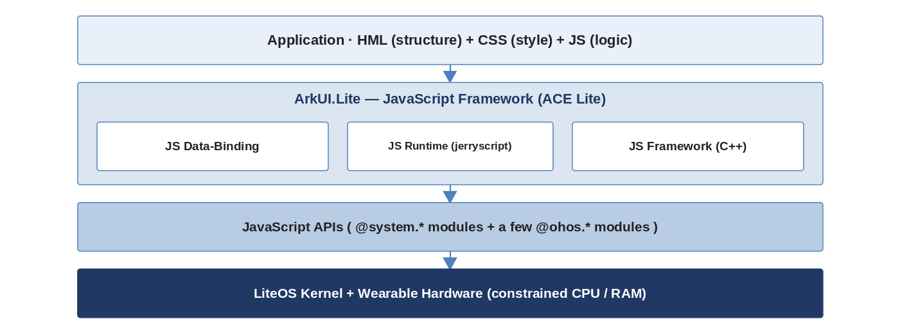

## 1.2 System Capabilities

A SystemCapability, or SysCap, is a fairly independent feature of the operating system. Each SysCap maps to a set of APIs. Whether those APIs work depends on whether the target device supports the matching capability. Different device types provide different capabilities. A Lite Wearable supports a focused set, smaller than a phone or tablet. In the reference documentation, each API shows the SysCap it belongs to. It uses the form `SystemCapability.xxx.xxx`. This helps you tell whether the API is available on a given device.

SysCap is organized around three related sets:

| Set                   | Describes                     | Meaning                                                                 |
|-----------------------|-------------------------------|-------------------------------------------------------------------------|
| Supported SysCap set  | Device capabilities           | The capabilities a device actually provides.                            |
| Required SysCap set   | Application capabilities      | The capabilities an application needs to run.                           |
| Associated SysCap set | Development-time capabilities | The capabilities the IDE offers for code completion during development. |

### 1.2.1 Checking Whether an API Is Available

Device capabilities differ. An application that may run on more than one device type should check capability availability at runtime. It should not assume the capability is there. Two methods are available.

The first method uses the `canIUse` API to test for a specific SysCap:

    if (canIUse("SystemCapability.ArkUI.ArkUI.Full")) {
      console.log("This device supports SystemCapability.ArkUI.ArkUI.Full.");
    } else {
      console.log("This device does not support SystemCapability.ArkUI.ArkUI.Full.");
    }

The behavior of a single SysCap can differ between device types, even when the capability is present. The reference documentation marks such cases. When you target Lite Wearable, do not assume a capability works the same as on a richer device.

**Figure 2.** Using canIUse() to confirm a capability is present on the target device before calling an API.

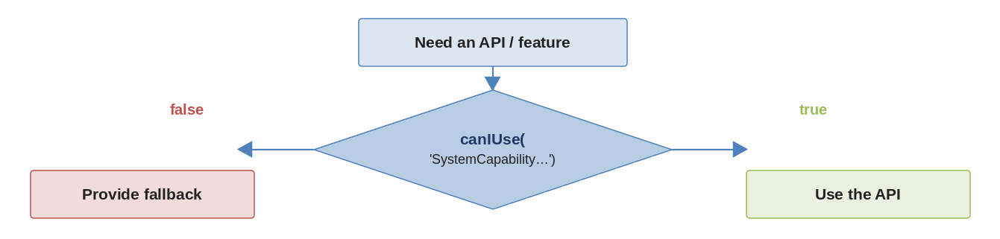

## 1.3 The FA Model

HarmonyOS has two application models: the Feature Ability (FA) model and the Stage model. For each module, the reference documentation marks whether its APIs work only in the FA model, only in the Stage model, or in both.

**Lite Wearable applications use the FA model only.** The Stage model and its ArkTS-based component system do not run on Lite Wearable. They are out of scope for this white paper. Every example in this document uses the FA model.

In practice, this shapes how a Lite Wearable application is built:

- The application is described by a `config.json` configuration file, not the Stage model’s `module.json5`.
- Application-level logic and lifecycle live in `app.js`, as described in Section 1.6.
- The user interface is built from web-like page bundles. Each bundle has an HML layout file, a CSS style file, and a JavaScript logic file, as described in Section 1.4.
- The UI is written with the web-like HML/CSS/JS framework, not with ArkTS `@Component` declarations.
- **Custom components are not supported.** You build pages only from the built-in components (Section 3.9).

These choices come from the FA model and from the platform’s resource limits. The rest of this document assumes them.

## 1.4 Web-like Development (HML / JS / CSS)

The Lite Wearable framework follows a web-like way of building. An application’s user interface is made of pages. Each page is built from three kinds of files. They mirror the markup, style, and script split of a web page.

### 1.4.1 File Roles

Inside a JavaScript module, the framework recognizes these files and folders:

| File or folder     | Role                                                                          |
|--------------------|-------------------------------------------------------------------------------|
| `.hml` files       | Describe the page layout.                                                     |
| `.css` files       | Describe the page style.                                                      |
| `.js` files        | Process the interactions between pages and users.                             |
| `app.js`           | Manages global JavaScript logic and the application lifecycle.                |
| `pages` directory  | Stores all component pages.                                                   |
| `common` directory | Stores public resource files, such as media resources and shared `.js` files. |
| `i18n` folder      | Stores resources in different languages, such as UI strings and image paths.  |

The `i18n` folder is reserved and cannot be renamed. Folders marked optional in the project structure can be created when needed after you create the project in the IDE.

Page routing is declared in the `config.json` file through the `js` tag. The tag holds the JavaScript instance name and the list of page routes. Each entry in `pages` has a page path and a page name. The application home page is fixed to `pages/index/index`:

    {
      "module": {
        "js": [
          {
            "name": "default",
            "pages": [
              "pages/index/index",
              "pages/detail/detail"
            ]
          }
        ]
      }
    }

### 1.4.2 File Access Rules

You can reference application resources by absolute path or relative path. In this framework, an absolute path begins with a slash (`/`). A relative path begins with `./` or `../`. The rules are:

- To reference a code file, use a relative path, for example `../common/utils.js`.
- To reference a resource file, use an absolute path, for example `/common/logo.png`.
- Store code and resource files in the `common` directory and access them as needed.
- In a `.css` file, use the `url()` function to make a URL, for example `url(/common/logo.png)`.

When one code file references another, the directory relationship matters. File locations can change during Webpack packaging. If the two files are in the same directory, you can use a relative or an absolute path. If they are in different directories, you must use an absolute path.

### 1.4.3 Supported Image Formats

The framework supports a small, fixed set of image formats. This reflects the platform’s lightweight design:

| Format | File Name Extension |
|--------|---------------------|
| BMP    | `.bmp`              |
| JPEG   | `.jpg`              |
| PNG    | `.png`              |

The `<image>` component can also read images from the application’s private directory. See the limitations in Section 1.5.

**Figure 3.** The web-like three-part model: HML defines structure, CSS defines style, and JS provides behavior, combining into a rendered page.

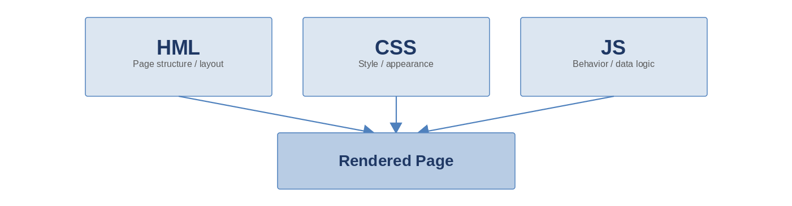

## 1.5 Limitations

Lite Wearable has limits by design. They come from its focus on long battery life and its lean hardware. Plan around the limits below.

| Area                         | Limitation                                                                                                                                                                                                                                                                                                         |
|------------------------------|--------------------------------------------------------------------------------------------------------------------------------------------------------------------------------------------------------------------------------------------------------------------------------------------------------------------|
| Application model            | FA model only. The Stage model and ArkTS `@Component`-based UI do not run on Lite Wearable.                                                                                                                                                                                                                        |
| Custom components            | Not supported. You build pages only from the built-in components.                                                                                                                                                                                                                                                  |
| JavaScript syntax            | Only a defined subset of ECMAScript 6.0 syntax is supported (see Section 1.1), not the full language.                                                                                                                                                                                                              |
| JavaScript runtime memory    | The running JavaScript has a small memory budget of about **48 KB**. If your code goes past it, the application crashes. Keep memory use well under this limit (see Chapter 6).                                                                                                                                    |
| Image formats                | Only BMP, JPEG, and PNG are supported. Other image formats are not available.                                                                                                                                                                                                                                      |
| Private storage              | Access to images in the application’s private directory uses the `internal://app/` prefix. The directory is visible only to the current application, is deleted when the application is uninstalled, and access to the parent directory using `../` is prohibited.                                                 |
| Data storage                 | Lite Wearable provides **no relational database and no SQLite**. The supported options are the key-value store (`@system.storage`), whose values are capped at **128 bytes** each, and file storage (`@system.file`). For larger data, prefer single-call file reads and writes with `Uint8Array` (see Chapter 6). |
| Background execution         | Lite Wearable provides **no background task management**. A hidden application should not expect to keep running. Finish work in the foreground and save state for the next launch (see Section 5.3 and Chapter 6).                                                                                                |
| Device simulator differences | The DevEco Studio previewer renders HML/CSS/JS but does not reproduce device-only capabilities: sensors, NFC card emulation, certain device services, Wear Engine communication, and real timing and memory pressure. Test capability-sensitive behavior on physical hardware (see Chapter 4).                     |

## 1.6 Lifecycle and Background Limitation

A Lite Wearable application has two related lifecycles. The application-level lifecycle is implemented in `app.js`. The page-level lifecycle is implemented in each page’s JavaScript file. You need to understand both to manage resources well on a constrained device. This matters most when the application moves between the foreground and the background.

### 1.6.1 Application Lifecycle

Application-level lifecycle logic lives in `app.js`. The framework calls `onCreate` when the application is created. It calls `onDestroy` when the application exits. These callbacks are the right place to set up and tear down global state and resources:

    // app.js
    export default {
      onCreate() {
        console.info('Application onCreate');
      },
      onDestroy() {
        console.info('Application onDestroy');
      },
    }

| Callback    | Triggered when              |
|-------------|-----------------------------|
| `onCreate`  | The application is created. |
| `onDestroy` | The application exits.      |

### 1.6.2 Page Lifecycle

Each page has its own lifecycle callbacks, defined in the page’s JavaScript file:

| Callback    | Triggered when                                                           |
|-------------|--------------------------------------------------------------------------|
| `onInit`    | Page initialization is complete. Called only once in the page lifecycle. |
| `onReady`   | The page has been created. Called only once in the page lifecycle.       |
| `onShow`    | The page is displayed.                                                   |
| `onHide`    | The page disappears.                                                     |
| `onDestroy` | The page is destroyed.                                                   |

The callbacks run in a set order as the user navigates:

- Opening a page A calls `onInit` → `onReady` → `onShow`.
- Opening page B on top of page A calls A’s `onHide` → `onDestroy`.
- Returning to page A from page B calls `onInit` → `onReady` → `onShow` again.
- Exiting page A calls `onHide` → `onDestroy`.
- Hiding page A (without destroying it) calls `onHide`.
- Bringing a backgrounded page A back to the foreground calls `onShow`.

So a page reads its routing parameters and does first-paint setup in `onInit`/`onReady`. It starts and stops time-sensitive work, such as animations and sensors, in `onShow`/`onHide`.

**Figure 4.** Application lifecycle (app.js) and page lifecycle callbacks, with the documented call sequences.

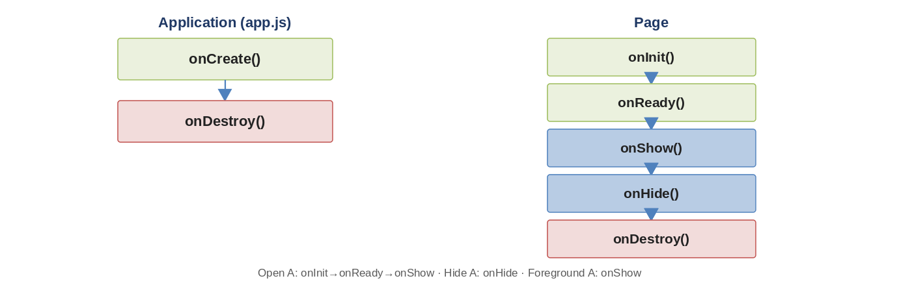

### 1.6.3 Background Limitation

The page lifecycle is how backgrounding becomes visible to an application. A page is no longer displayed when the user navigates away, switches to another application, or the screen turns off. The affected page then receives `onHide`. When it is shown again, it receives `onShow`. Treat `onHide` as the signal to pause non-essential work, release costly resources, and stop UI animations. Treat `onShow` as the signal to resume.

On a Lite Wearable device, this is not just good practice. It is a real necessity. Lite Wearable provides no background task management at all (see Section 5.3). A hidden application should not expect to keep running. Any work that must survive backgrounding should be finished before `onHide` and saved, so it can resume on the next `onShow` or `onInit`.

# 2 Pre-Development

You must do a small amount of setup before you write any HML, CSS, or JavaScript. A Lite Wearable app is not a normal web project. It is a signed app that is tied to your identity. It runs on a device platform with strict rules. This chapter covers the four things you finish before you start to build: open and verify a developer account, learn how app signing works, get the device identifier (UDID) you need to debug on real hardware, and install the tools (DevEco Studio and the DevEco Assistant).

The goal is to help you understand why each step matters. The exact steps come from the Huawei developer portal, and they can change between releases. Once you know the reason for each step, you can follow those steps with confidence.

## 2.1 Opening and Verifying a Developer Account

You need a verified developer identity to put a signed app on a wearable device. This is true even for side-loading, which means installing an app yourself without using a store. Your account is the root of trust. Every later credential, signing certificate, and provisioning profile starts from it.

The flow is simple. You register an account. You choose an account type, individual or enterprise. You submit the required identity documents. Then you wait for verification to finish. Individual and enterprise accounts ask for different documents. They also unlock different features. Enterprise accounts usually support more device and distribution features.

The exact screens, the list of accepted identity documents, and the verification wait time come from the Huawei developer portal. They can change between releases, so check the current portal docs for the up-to-date steps. The purpose of this step does not change. It sets up the verified identity that all your later signing credentials come from.

## 2.2 Application Signing

Every app that runs on the platform must be signed with cryptography. Signing does three things. It proves who the publisher is. It shows the package was not changed after the build. It ties the app to the permissions and devices the platform has approved.

The signing model uses a few parts that work together. It helps more to know what each part is than to memorize where you download it.

| Artifact                          | Role                                                                                                                                                                               |
|-----------------------------------|------------------------------------------------------------------------------------------------------------------------------------------------------------------------------------|
| Key pair (private/public)         | Made on your computer and kept in a keystore. The private key signs the package. It must never leave your machine.                                                                 |
| Certificate Signing Request (CSR) | Made from the public key. You send it to the platform to ask for a signing certificate.                                                                                            |
| Signing certificate               | Issued by the platform from the CSR. It confirms the public key belongs to the verified developer.                                                                                 |
| Provisioning profile              | Ties together the certificate, the app’s bundle identifier, the requested permissions, and (for debug builds) the list of approved test devices. It is one authorization document. |
| Keystore (e.g., .p12)             | The secure container on your computer. It holds the key pair and certificate that the build tools use.                                                                             |

In practice, you make a key pair and a CSR. DevEco Studio can do this for you. You upload the CSR to get a certificate. You create a provisioning profile. The profile lists the app identifier and the approved device UDIDs, which matter a lot for Lite Wearable debugging. Last, you set up the build to sign the package with the keystore and the profile. A debug profile lets you install on certain registered devices. A release profile lets you distribute the app.

One Lite Wearable rule shapes this whole workflow. A Lite Wearable **cannot connect to DevEco Studio. So the app cannot be signed automatically. You must sign it by hand** and set the signature information yourself. You make the key material, register each test device, get the certificate and provisioning profile, and then point the build at them. Two limits are worth remembering. The device **UDID must be added to the signature**. And **no more than ten UDIDs** can be registered on one signature. Verification also fails if the signing **certificate has expired**. A signature error at install time shows up as installation error code 31 (see Chapter 5).

**Figure 5.** The application signing model: a key pair yields a CSR, the platform issues a certificate, a provisioning profile binds the certificate, application identity, and authorized device UDIDs, and the signed package installs only on authorized devices.

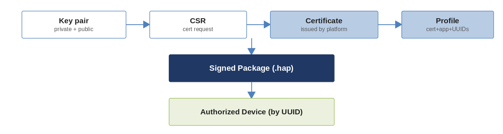

## 2.3 Obtaining the Device UDID

To install and debug a build on a real Lite Wearable device, you must add the device to the debug provisioning profile. You add it by its unique identifier (UDID). The UDID is a stable value for each device. The platform uses it to keep debug builds on hardware that you own.

You read the UDID from the connected device. DevEco Studio or the DevEco Assistant usually shows it once the wearable is paired and connected. Then you register the UDID in the developer portal so it can go into the debug profile. Only devices listed in the profile will accept a debug install. So when you add a new test device, you must make the profile again.

You register the device UDID through the device-registration step on the developer portal. Then it is tied into the debug signature. You can register a **maximum of ten devices** on one signature. The UDID is part of the signature. So adding a new test device means you register it and **re-sign** the package. If an install fails with a signature error (code 31, Chapter 5), check these things first: was the UDID added, did you go over the ten-device limit, and has the certificate expired.

To register a device and add its UDID, follow Huawei’s *Registering a Device* guide: <https://developer.huawei.com/consumer/en/doc/app/agc-help-add-device-0000002283189937>.

## 2.4 Installing the Toolchain: DevEco Studio and DevEco Assistant

Two tools make up the Lite Wearable development environment.

**DevEco Studio** is the main development tool, also called an IDE. It sets up a new project for the FA model. It gives you the HML, CSS, and JS editors and a previewer. It runs the build and signing pipeline. It also handles deployment and debugging on the device.

**DevEco Assistant** is a helper tool you use during testing. It helps you pair and connect a device. It shows device information, including the UDID. It supports the full debugging workflow described in Chapter 4.

To install DevEco Studio, follow Huawei’s installation guide and download the current release for your operating system: <https://developer.huawei.com/consumer/en/doc/harmonyos-guides/ide-software-install>. Then install the required SDK components and device toolchains through the built-in package manager. Sign in with your verified developer account so the signing services work inside the IDE. Install the **DevEco Assistant** app on the paired phone as well; it is the tool that reads the device UDID and runs the build on the watch (Chapter 4). You can get the DevEco Assistant app here: <https://gitcode.com/jianglulu/DevEcoAssistant>.

In practice, create the project from the **\[Lite\]Empty Ability** template and pick **Lite Wearable** as the device type. To test on a device, you also need a Huawei phone with a system version earlier than HarmonyOS 5. That phone needs the latest **Huawei Health** app and the **DevEco Assistant** app. Together they connect the wearable to your development workflow (see Chapter 4). The wearable never connects to DevEco Studio directly. That is why manual signing (Section 2.2) is required.

**Figure 6.** Creating a project in DevEco Studio. Choose the Lite Empty Ability template and set the device type to Lite Wearable. (Redrawn from the DevEco Studio New Project dialog.)

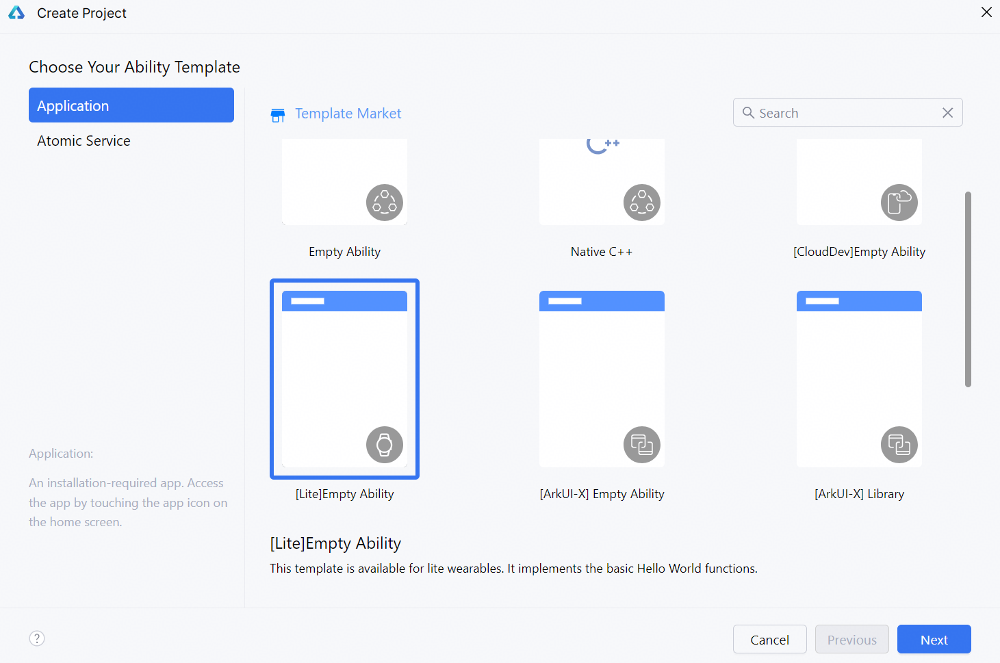

## 2.5 Pre-Development Checklist

Before you move to Chapter 3, you should have: a verified developer account; a key pair and keystore; a signing certificate; a debug provisioning profile that lists the test device UDID(s); and a working install of DevEco Studio and DevEco Assistant, signed in with your developer account. With these ready, you can create your project and start to build.

Useful links:

- Installing DevEco Studio: <https://developer.huawei.com/consumer/en/doc/harmonyos-guides/ide-software-install>
- Registering a device and its UDID: <https://developer.huawei.com/consumer/en/doc/app/agc-help-add-device-0000002283189937>
- DevEco Assistant app: <https://gitcode.com/jianglulu/DevEcoAssistant>

# 3 Development

This chapter is the practical core of the white paper. It shows how a developer builds an app for a HarmonyOS Lite Wearable device. It covers how a project is laid out on disk, how it is declared and configured, and how the three source layers (HML, CSS, JavaScript) work together to make a running page. It also lists the UI components you can use and the JavaScript APIs the platform offers.

One fact shapes everything in this chapter. A Lite Wearable device runs **only the Feature Ability (FA) model** with the **web-like JavaScript runtime** (once called ArkUI.Lite). You write pages in HML (markup), CSS (style), and JavaScript (logic). You declare the app in a `config.json` file, and an `app.js` file starts it. The newer ArkTS / Stage-model tools (`@Entry`/`@Component` components, `module.json5` modules, the full `@kit.*` API set) do **not** run on Lite Wearable hardware. So they are out of scope here.

A second point is easy to get wrong. The JavaScript APIs on Lite Wearable come from two kinds of modules. Most are `@system.*` modules (for example `@system.storage`, `@ohos.router`, `@system.device`, `@system.configuration`). A few are `@ohos.*` modules (for example `@ohos.security.huks` and `@ohos.nfc.cardEmulation`). Much of the reference documentation marks many of these APIs as “deprecated since API version 9.” For most device types that note is correct. For Lite Wearable it is not, the documentation adds “**except for lite wearables**.” On this platform these are the valid, standard APIs to use, and this chapter treats them that way.

## 3.1 Project Structure

At the source level, a Lite Wearable application is a JavaScript FA module. The framework expects a fixed directory layout rooted at `entry/src/main/js/<module>`. The `<module>` name matches the JavaScript instance name in `config.json`, which is usually `default`. The figure below shows the typical structure.

    entry/
    └── src/
        └── main/
            ├── js/
            │   └── default/                  ← JavaScript module (instance "default")
            │       ├── app.js                ← global logic + application lifecycle
            │       ├── i18n/                  ← reserved folder for localized resources
            │       │   ├── en-US.json
            │       │   └── zh-CN.json
            │       ├── common/                ← shared resources and shared .js code
            │       │   ├── images/
            │       │   └── utils.js
            │       └── pages/                 ← one folder per page
            │           ├── index/
            │           │   ├── index.hml      ← page layout
            │           │   ├── index.css      ← page style
            │           │   └── index.js       ← page logic
            │           └── detail/
            │               ├── detail.hml
            │               ├── detail.css
            │               └── detail.js
            └── config.json                   ← project configuration (the "js" tag)

The tree above shows the role of each file and folder in its comments: `app.js` holds global logic, `pages/` holds one folder per page (each with an `.hml`, `.css`, and `.js` file), `common/` holds shared media and `.js` files, and `i18n/` holds language resources.

Two folders have their own rules. The `i18n` folder is **reserved** and must not be renamed. The framework finds it by name. The reference documentation marks some folders as optional. You can create them when you need them, after DevEco Studio generates the project.

### File access rules

You reference resources by an absolute or a relative path. An **absolute path starts with a slash** (`/`). A **relative path starts with** `./` **or** `../`. The rules are exact, so learn them well:

- To reference a **code file** (`.js`), use a **relative** path: `../common/utils.js`.
- To reference a **resource file** (image, etc.), use an **absolute** path: `/common/logo.png`.
- In a `.css` file, build a URL with the `url()` function: `url(/common/logo.png)`.
- Store both code files and resource files under `common/`, and reference them as the rules above require.

One more rule covers code files that reference each other. If code file A and code file B sit in the **same directory**, B may use either a relative or an absolute path for its resources. If A and B are in **different directories**, B **must** use an absolute path. The reason is that Webpack moves B during packaging, so a relative path would no longer work. Section 3.4 looks at this again.

### Supported media formats

The image components support a small, fixed set of raster formats.

| Format | Extension |
|--------|-----------|
| BMP    | `.bmp`    |
| JPEG   | `.jpg`    |
| PNG    | `.png`    |

The `<image>` component can also read images from the app’s private directory. You address that directory with the `internal://app/` prefix. The directory is visible only to the current app. It is deleted when the app is uninstalled, and you cannot escape it with `../`.

**Figure 7.** Typical FA-model project structure for a JavaScript module.

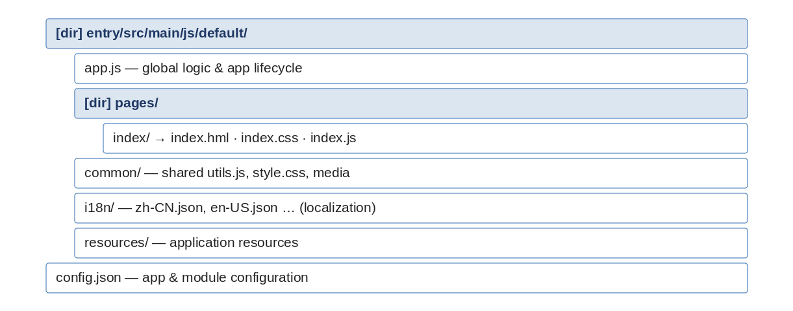

## 3.2 Project Configuration

You declare the app in `config.json`. Inside the `module` object, the `js` **tag** is an array. It declares each JavaScript instance and its page routes.

### The `js` tag

| Tag     | Type   | Default   | Mandatory | Description                                                             |
|---------|--------|-----------|-----------|-------------------------------------------------------------------------|
| `name`  | string | `default` | Yes       | Name of the JavaScript instance. Matches the module folder under `js/`. |
| `pages` | Array  | –         | Yes       | Route information: the list of page paths.                              |

Each entry in `pages` is a page path of the form `pages/<folder>/<file>` (without the extension). The framework finds the matching `.hml`, `.css`, and `.js` files next to it. Two rules apply:

- The app home page is **fixed** to `pages/index/index`, and it must be the first entry.
- A page name must not match a component name. `text.hml` or `button.hml` are invalid page names.

<!-- -->

    {
      "app": {
        "bundleName": "com.example.player",
        "version": { "code": 1, "name": "1.0" },
        "vendor": "example"
      },
      "module": {
        "js": [
          {
            "name": "default",
            "pages": [
              "pages/index/index",
              "pages/detail/detail"
            ]
          }
        ],
        "abilities": [
          {
            "...": "ability declarations"
          }
        ]
      }
    }

### Application identity, device type, and permissions

The `app` object holds the app identity: `bundleName`, `version` (with `code` and `name`), and `vendor`. The `module` object holds the device-type declaration and the ability declarations. For a Lite Wearable target, the device type is `liteWearable`. Media queries (section 3.6) and the `@system.device` API (section 3.10) use this same value.

You declare permissions in the `module` object. In the FA model the permission array is named `reqPermissions` (the Stage model uses `requestPermissions`). Each entry has a permission `name`, a `reason` string resource, and a `usedScene`. The card-emulation example in Section 3.10 shows a full FA-model permission block. The two permissions a Lite Wearable NFC app declares are:

| Permission                           | What it allows                                                                                       |
|--------------------------------------|------------------------------------------------------------------------------------------------------|
| `ohos.permission.NFC_CARD_EMULATION` | Lets the app emulate a card and exchange data with an NFC reader. This is Host Card Emulation (HCE). |
| `ohos.permission.NFC_TAG`            | Lets the app read and write NFC tags.                                                                |

Both apply to Lite Wearable. The card-emulation module documents a Host Card Emulation (HCE) form made specifically for lite wearables (Section 3.10).

> **Configuration note.** Beyond the `js` tag and `app` identity shown above, the `module` object sets `deviceType` to `liteWearable`. A square form also uses a `distroFilter` with a `screenShape` policy (Section 3.12.4). Set the vendor’s `compatibleSdkVersion` to `3` for Lite Wearable. Keep the app `label` resource name to 22 characters or fewer. A wrong value shows as installation error code 47 or 40 (Chapter 5).

## 3.3 Key Source Files and Their Roles

A Lite Wearable app is built from a small, clear set of source files. The fastest way to understand the system is to know what each file is responsible for.

### The starter app (\[Lite\]Empty Ability)

When you create a project from the **\[Lite\]Empty Ability** template, DevEco Studio builds a small “Hello World” app. This is the best place to start. The home page lives in `pages/index/` and uses three files. The `app.js` file (shown next) completes the app.

    <!-- pages/index/index.hml -->
    

      <text class="title">Hello {{ title }}</text>
    

    /* pages/index/index.css */
    .container {
      flex-direction: column;
      justify-content: center;
      align-items: center;
      width: 100%;
      height: 100%;
    }
    .title {
      font-size: 30px;
      text-align: center;
    }
    // pages/index/index.js
    export default {
      data: {
        title: 'World',
      },
      onInit() {
        // The page is ready. Set up page data here.
      },
    };

### `app.js`: global logic and application lifecycle

`app.js` is the single application-level entry point. It exports a default object whose methods run the **application** lifecycle. Two callbacks are available:

| Callback      | Triggered when                        |
|---------------|---------------------------------------|
| `onCreate()`  | The application is created.           |
| `onDestroy()` | The application exits / is destroyed. |

    // app.js
    export default {
      onCreate() {
        console.info('Application onCreate');
      },
      onDestroy() {
        console.info('Application onDestroy');
      },
    }

Use `app.js` for one-time global setup, such as reading saved preferences or setting up shared state. Use it for global cleanup too. Pages can reach data attached to the exported app object through the application context (see section 3.7).

### `.hml` / `.css` / `.js` per page

Every page is a set of three same-named files in its own folder. Each file has a clear, separate job. Sections 3.5 through 3.8 explain them in detail:

- `.hml` declares *what* is on the page: the component tree, data bindings, and event bindings.
- `.css` declares *how* it looks: selectors, layout, color, and animation.
- `.js` declares *how it behaves*: the page data model, lifecycle callbacks, and event handler methods.

### `common/`

`common/` is the shared library of the module. It holds media (images under `common/images/`) and reusable JavaScript modules. A page imports shared code with a relative path and references shared media with an absolute path:

    import utils from '../../common/utils.js';   // code: relative path

### `i18n/`

`i18n/` holds one resource file per language, usually in JSON (`en-US.json`, `zh-CN.json`, and so on). Each file contains UI text and locale-specific image paths. The folder name is reserved. You can read the current locale at runtime with `@system.configuration` (section 3.10). This lets the page logic pick the correct resource set.

> **Localization note.** Language resource files live in the `i18n` folder. They are named by language-country/region (for example `zh-CN.json`, `en-US.json`). The active language follows the paired phone’s language and region settings. See Section 3.12.1 for the full behavior.

## 3.4 Development Rules

A few rules, learned early, prevent the most common build-time and run-time failures.

**Relative versus absolute paths.** As stated in 3.1: reference code files (`.js`) with relative paths, and resource files (images, etc.) with absolute paths. The reason is structural, not stylistic. The two kinds of reference are resolved at different stages of the toolchain.

**Resource referencing in CSS.** In a `.css` file, always wrap a resource in `url()` with an absolute path, for example `background-image: url(/common/bg.png);`. Relative resource URLs in CSS are not reliable.

**The Webpack packaging caveat.** When one code file references another code file in a **different** directory, the path must be **absolute**. During Webpack packaging the module moves to a new physical location, so any relative path inside it would break. Same-directory references do not have this problem and may be relative. This one rule is the most common cause of “module not found” errors that appear only after packaging, never in the editor.

**Reserved folder names.** `i18n` is reserved and must keep its name. Page folders under `pages/` can have any name, but a page file must not be named after a component (`text`, `button`, `image`, and so on).

**The home page is fixed.** `pages/index/index` is the required first route. The page-routing stack holds at most **32** pages (section 3.10).

**ECMAScript subset.** Page logic is JavaScript, but the Lite Wearable engine supports only a set part of ES6. See section 3.7. HML expressions are even more limited: **ES6 syntax is not allowed inside HML** `{{ }}` expressions. Array changes must use `splice` to be reactive (section 3.5).

Before the details, it helps to see how the three layers divide the work. Each layer has one job. Keeping each job in its own layer makes a page easy to maintain and keeps the renderer fast.

| Concern          | Layer      | Handles                                                                                                                                | Does *not* handle                                             |
|------------------|------------|----------------------------------------------------------------------------------------------------------------------------------------|---------------------------------------------------------------|
| **Structure**    | HML        | Component tree; data bindings (`{{ }}`); event bindings (`@`/`on`); conditional rendering (`if`/`show`); list rendering (`for`/`tid`). | Visual styling; business logic; ES6 logic inside expressions. |
| **Presentation** | CSS        | Selectors; layout (flexbox); size, color, border, opacity; animation (`transform`, `@keyframes`); media queries.                       | Component existence; data; control flow.                      |
| **Behavior**     | JavaScript | `data` model; lifecycle callbacks; event-handler methods; `$refs` imperative calls; API calls; routing.                                | Markup layout; static styling.                                |

Sections 3.5 to 3.7 describe each layer in turn.

## 3.5 HML: Usage and Details

HML (HarmonyOS Markup Language) is an HTML-like language. It describes a page as a tree of components and the events bound to them. It offers data binding, event binding, conditional rendering, and list rendering. A page’s HML file has one root component, usually a `
`.

    <!-- index.hml -->
    

      <text class="item-title">Image Show</text>
      

        <image src="/common/logo.png" class="image"></image>
      

    

### Data binding

Double curly braces bind a component’s content or attribute to a property of the page’s `data` model. The binding is one-way, from the model to the view. The view re-renders by itself when the data changes.

    <!-- xxx.hml -->
    

      <text> {{ content[1] }} </text>
    

    // xxx.js
    export default {
      data: {
        content: ['Hello World!', 'Welcome to my world!']
      },
      changeText() {
        this.content.splice(1, 1, this.content[0]);
      }
    }

Two rules govern data binding. First, **to make an array change reactive, use** `splice`. Direct index assignment (`this.content[1] = …`) does not cause a re-render. Second, **ES6 syntax is not supported inside HML expressions**. Keep `{{ }}` content to simple property access and basic operators.

### Event binding

You bind an event with the `@` prefix or the `on` prefix. The handler receives an event object. Handlers may take literal or bound arguments.

    <!-- xxx.hml -->
    

      <!-- Bind with @ -->
      

      <!-- Bind with on -->
      

      <!-- Bubbling forms (API 5+) -->
      

      

          <!-- equivalent to on:click.bubble -->
      <!-- Bind but stop bubbling (API 5+) -->
      

      

        <!-- equivalent to grab:click.bubble -->
    

    <!-- Passing arguments -->
    <input type="button" value="increase" onclick="increase" />
    <input type="button" value="double"   @click="multiply(2)" />
    <input type="button" value="square"   @click="multiply(count)" />
    // xxx.js
    export default {
      data: { count: 0 },
      increase() { this.count++; },
      multiply(multiplier) { this.count = multiplier * this.count; }
    };

Event bubbling is supported since API version 5. Note one migration caveat. Events bound with an old statement such as `onclick` will *not* bubble after an SDK upgrade unless you repack the app. To bind a non-bubbling handler on purpose, use `grab:click`.

### Conditional rendering: `if` / `elif` / `else` and `show`

There are two ways to do this, and they have different costs:

- `if` **/** `elif` **/** `else` add or remove the component from the virtual DOM. When the condition is false, the component is *not built* and *not rendered*. The three statements must be on **sibling** nodes, or compilation fails.
- `show` keeps the component in the virtual DOM but toggles its `display`. When `show` is false, the component’s display style becomes `none`. The component is built but not painted.

<!-- -->

    <!-- if / elif / else -->
    <text if="{{show}}"> Hello-One </text>
    <text elif="{{display}}"> Hello-Two </text>
    <text else> Hello-World </text>

    <!-- show -->
    <text show="{{visible}}"> Hello World </text>

Use `if` when the branch is rarely shown, because it saves the cost of building the subtree. Use `show` when a component toggles often, because it avoids repeated build and teardown.

### List rendering: `for` and `tid`

The `for` attribute repeats an element once per array item. Three forms are available. The optional `tid` attribute names the unique key that speeds up re-rendering.

    <!-- xxx.hml -->
    

      <!-- $item = element, $idx = index (defaults) -->
      

        <text>{{$idx}}.{{$item.name}}</text>
      

      <!-- named element variable; index is still $idx -->
      

        <text>{{$idx}}.{{value.name}}</text>
      

      <!-- named index and element variables -->
      

        <text>{{index}}.{{value.name}}</text>
      

    

| `for` form                  | Element variable | Index variable |
|-----------------------------|------------------|----------------|
| `for="{{array}}"`           | `$item`          | `$idx`         |
| `for="{{v in array}}"`      | `v`              | `$idx`         |
| `for="{{(i, v) in array}}"` | `v`              | `i`            |

The `tid` attribute names a field that uniquely identifies each item. It makes re-rendering faster when the list changes. If you leave it out, the framework uses the array index as the key. Three rules apply. Every array element must have the `tid` field. The field’s value must be unique across the array, or performance drops. And `tid` **does not support expressions**: it is a plain field name. Finally, **do not use** `for` **and** `if` **on the same element**.

### Page references and templates

A page’s component tree is built from the universal containers and basic components of section 3.9. HML supports composition through nested containers (`div`, `stack`, `list`, `swiper`). To move between separate pages, use the router API (section 3.10) rather than in-markup page includes.

## 3.6 CSS: Usage and Details

CSS describes how the components from HML are displayed. Every component has a default style, and CSS overrides it. You can apply styles inline (the `style` attribute), through `class` references to a `.css` file, or by importing a shared stylesheet.

### Style declaration and import

The `.css` file with the same name as a page’s `.hml` file styles that page. To share style across pages, keep one common stylesheet (for example `common/style.css`) and pull it into each page’s `.css` with `@import`. This is the standard way to reuse colors, spacing, and component styles, and it keeps each page file small. Place all shared stylesheets under `common/`.

    /* index.css */
    @import '../../common/style.css';
    .container {
      justify-content: center;
    }

Precompiled styles are supported. Rename a `.css` file to `.less`, `.sass`, or `.scss` to use variables and computation. Precompiled shared files also belong in `common/`.

    /* index.less */
    @colorBackground: #000000;
    .container { background-color: @colorBackground; }

### Selectors

| Selector    | Example            | Selects                                               |
|-------------|--------------------|-------------------------------------------------------|
| `.class`    | `.container`       | All components whose `class` is `container`.          |
| `#id`       | `#titleId`         | The component whose `id` is `titleId`.                |
| `,` (group) | `.title, .content` | All components whose class is `title` *or* `content`. |

### Pseudo-classes

Two pseudo-classes are available, with an important Lite Wearable limit.

| Pseudo-class | Applies to                        | Lite Wearable note                                         |
|--------------|-----------------------------------|------------------------------------------------------------|
| `:active`    | `input[type="button"]`            | Only `background-color` and `background-image` may be set. |
| `:checked`   | `input[type="checkbox"\|"radio"]` | Only `background-color` and `background-image` may be set. |

    /* index.css */
    .button:active {
      background-color: #888888;
    }

### Common styles and units

The universal styles below apply to almost every component. You express lengths in `px`, the framework’s logical pixel. The example screens are 454×454. The `width` and `height` styles also accept percentages.

> **Font note.** Lite Wearable supports only one font: `SourceHanSansSC-Regular`. The `font-family` style accepts no other value. Plan your text layout around this single font.

| Style                                           | Type                         | Default | Notes                                              |
|-------------------------------------------------|------------------------------|---------|----------------------------------------------------|
| `width`, `height`                               | `<length>` \| `<percentage>` | `0`     | Component size.                                    |
| `padding`, `padding-[left\|top\|right\|bottom]` | `<length>`                   | `0`     | 1–4 value shorthand (clockwise from top).          |
| `margin`, `margin-[left\|top\|right\|bottom]`   | `<length>` \| `<percentage>` | `0`     | 1–4 value shorthand.                               |
| `border-width`                                  | `<length>`                   | `0`     | All borders.                                       |
| `border-color`                                  | `<color>`                    | `black` | All borders.                                       |
| `border-radius`                                 | `<length>`                   | –       | Round-corner radius.                               |
| `background-color`                              | `<color>`                    | –       | Background fill.                                   |
| `opacity`                                       | number                       | `1`     | `0` transparent … `1` opaque.                      |
| `display`                                       | string                       | `flex`  | `flex` (flexible layout) or `none` (not rendered). |
| `[left\|top]`                                   | `<length>` \| `<percentage>` | –       | Edge offset of a positioned element.               |

You can give color as `rgb(...)`, `rgba(...)`, a hex string (`#rrggbb` or `#aarrggbb`), or one of the 140-plus named color enums (for example `cornflowerblue`, `tomato`, `darkcyan`). The named enum form does **not** work from JavaScript. In script, use hex or `rgb`/`rgba`.

Layout uses flexbox. A container’s `flex-direction` (`row`/`column`), `flex-wrap`, `justify-content`, and `align-items` position its children. The `
` component (section 3.9) is the standard flex container.

### Animation styles

Components support translation, rotation, and scaling. You set these through the `transform`, `animation-*`, and `@keyframes` rules.

| Property                    | Type                 | Default  | Notes                                           |
|-----------------------------|----------------------|----------|-------------------------------------------------|
| `transform`                 | string               | –        | `translateX`, `translateY`, `rotate`.           |
| `animation-name`            | string               | –        | References a `@keyframes` rule.                 |
| `animation-delay`           | `<time>`             | `0`      | `ms` or `s`; default unit `ms`.                 |
| `animation-duration`        | `<time>`             | `0`      | **Must be set** or the animation never plays.   |
| `animation-iteration-count` | number \| `infinite` | `1`      | Repeat count.                                   |
| `animation-timing-function` | string               | `linear` | `linear`, `ease-in`, `ease-out`, `ease-in-out`. |
| `animation-fill-mode`       | string               | `none`   | `none` or `forwards` (hold the final frame).    |

    @keyframes Go {
      from { background-color: #f76160; }
      to   { background-color: #09ba07; }
    }

Two Lite Wearable limits matter. **Only images at their original size can be rotated.** And a `@keyframes` rule written with `from`/`to` **cannot be dynamically bound** to an element.

### Media query

`@media` adapts the style to device features. The device type for a wearable is `liteWearable`. Match round screens with `round-screen: true`.

    @media (device-type: liteWearable) {
      .container {
        width: 300px;
        height: 300px;
        background-color: #008b8b;
      }
    }
    @media screen and (round-screen: true) and (max-height: 454) {
      /* round-screen, 454px-tall layout */
    }

The supported media features are `height`/`min-height`/`max-height`, `width`/`min-width`/`max-width`, `aspect-ratio` (with its min/max forms), and `round-screen`. The logical operators `and` and `or` combine features (`or` since API 9). The comparison operators `<=`, `>=`, `<`, `>` are **not** supported. Use the `min-`/`max-` feature forms instead. One query statement is limited to 512 characters and one condition to 32. The number and type of attributes you set in each `.container` block must match across breakpoints, or display errors occur.

## 3.7 JS: Usage and Details

A page’s `.js` file defines its service logic. The file exports a default object, the **page object**. The framework recognizes its well-known properties (`data`, lifecycle callbacks) and its other methods (event handlers).

### Supported ECMAScript subset

The engine supports ES6, but on Lite Wearable **only** the following ES6 features are available:

`let`/`const`, arrow functions, `class`, default parameter values, destructuring assignment, destructuring binding patterns, enhanced object initializers, `for-of`, rest parameters, and template strings.

The runtime is a lightweight engine based on jerryscript, so it is not a full ES6 engine. **Only the features in the list above work.** Anything outside the list does **not** work on the device, including `async`/`await`, generators, `Proxy`/`Reflect`, the full `Promise` library, dynamic `import()`, and `eval`. Do not use them; write all logic with the supported subset only. This also helps performance: simpler imperative code is faster on a constrained device (see Chapter 6).

**Figure 8.** The Lite Wearable JavaScript engine supports only a subset of ES6; features outside this set should be avoided.

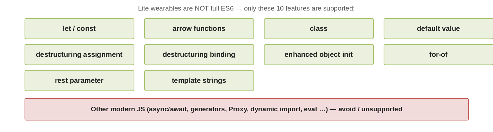

You import modules in one of two forms. Import a framework module by its `@` name, or import local code by relative path:

    import router from '@ohos.router';        // framework module
    import utils  from '../../common/utils.js';  // local code

### The page object: `data` and `$refs`

| Property | Type               | Description                                                                                                                                                                    |
|----------|--------------------|--------------------------------------------------------------------------------------------------------------------------------------------------------------------------------|
| `data`   | Object \| Function | The page’s data model. If a function, it must return an object. Property names may not start with `$` or `_`, and may not be the reserved words `for`, `if`, `show`, or `tid`. |
| `$refs`  | Object             | DOM elements or child component instances that registered a `ref` attribute in HML.                                                                                            |

### Page lifecycle callbacks

Each page also defines lifecycle callbacks (`onInit`, `onReady`, `onShow`, `onHide`, `onDestroy`). Section 1.6 lists each callback and its exact call order. In short: read routing parameters and do first-paint setup in `onInit`/`onReady`, and start or stop time-sensitive work (such as animations and sensors) in `onShow`/`onHide`.

### Accessing DOM elements via `$refs`

A component that declares `ref="name"` in HML is reachable as `this.$refs.name` in script. This gives you the component’s imperative methods, such as the `image-animator` controls.

    <!-- index.hml -->
    <image-animator ref="animator" images="{{images}}" duration="1s" onclick="handleClick"></image-animator>
    // index.js
    export default {
      data: {
        images: [
          { src: '/common/frame1.png' },
          { src: '/common/frame2.png' },
          { src: '/common/frame3.png' },
        ],
      },
      handleClick() {
        const animator = this.$refs.animator;     // the referenced DOM element
        const state = animator.getState();
        if (state === 'paused')      { animator.resume(); }
        else if (state === 'stopped'){ animator.start();  }
        else                         { animator.pause();  }
      },
    };

### Accessing application-level data and page routing

Page logic can reach the setup you do in `app.js` through the application context. You move between pages with the router module. Section 3.10 has the full method reference.

    import router from '@ohos.router';

    export default {
      goDetail() {
        router.push({ uri: 'pages/detail/detail', params: { id: 42 } });
      }
    };

On the target page, `router.getParams()` returns the passed parameters. In the web-like paradigm, you can also use direct property access, such as `this.id`.

## 3.8 Boundaries Between HML, CSS, and JavaScript

The overview table at the start of Section 3.5 shows which layer does what. Three boundary facts are worth stressing:

1.  **HML expressions are not a programming language.** They cannot run ES6. They evaluate simple bindings. All real logic belongs in the `.js` file.
2.  **Reactivity comes from** `data`**.** The view updates only when a `data` property changes, and array changes must go through `splice`. Styling a hidden element in CSS does not make it appear. HML’s `if`/`show` and the `display` style together control visibility.
3.  **Styling enums are CSS-only.** The named color enumeration works in CSS but not from JavaScript. Script code must use hex or `rgb`/`rgba` strings.

## 3.9 Available Components

The Lite Wearable component set splits into **containers** (which hold children and arrange layout) and **basic components** (leaf widgets). Every component shares the universal attributes `id`, `style`, `class`, and `ref`. Every component shares the universal events `click`, `longpress`, and `swipe`. The `swipe` event carries a `SwipeEvent` with a `direction` of `left`/`right`/`up`/`down`. Every component also shares the universal styles of section 3.6. The tables below list only each component’s distinctive attributes, events, and methods.

### Container components

`
`: the basic flex container; the root of a page or a grouping box.

| Distinctive styles | Values                                                                      |
|--------------------|-----------------------------------------------------------------------------|
| `flex-direction`   | `row` (default) \| `column`                                                 |
| `flex-wrap`        | `nowrap` (default) \| `wrap`                                                |
| `justify-content`  | `flex-start` \| `flex-end` \| `center` \| `space-between` \| `space-around` |
| `align-items`      | `stretch` (default, API 5+) \| `flex-start` \| `flex-end` \| `center`       |

`<list>`: a vertical, equal-width scrolling container. It accepts **only** `<list-item>` children. It supports the universal events. Its `flex-direction` style defaults to `column` and cannot be changed at runtime. (Scroll-position events and scroll-to methods are not available on Lite Wearable.)

`<list-item>`: a single row of a `<list>`. It supports child components. It carries the universal attributes and styles only.

`<stack>`: a stacking container; later children sit on top of earlier ones. Child positions are absolute, so **you cannot set** `margin` **on stack children** (absolute positioning does not accept a percentage).

`<swiper>`: a swipe-to-switch container. It supports all children **except** `<list>`.

| Attribute      | Type        | Default | Description                                                      |
|----------------|-------------|---------|------------------------------------------------------------------|
| `index`        | number      | `0`     | Index of the currently shown child.                              |
| `loop`         | boolean     | `true`  | Whether looping is enabled.                                      |
| `duration`     | number      | –       | Autoplay duration for child switching.                           |
| `vertical`     | boolean     | `false` | Vertical swipe (vertical indicator); not dynamically changeable. |
| Event `change` | `{ index }` | –       | Fired when the shown index changes.                              |

### Basic components

`<text>`: displays a string. Distinctive styles: `color` (default `#ffffff`), `font-size` (default `30px`), `letter-spacing`, `text-align` (`left`/`center`/`right`), `text-overflow` (`clip`/`ellipsis`), `font-family` (only `SourceHanSansSC-Regular` is supported).

`<image>`: renders a PNG or JPG image through its `src` attribute.

`<image-animator>`: plays an image-frame animation.

| Member                                      | Notes                                                                            |
|---------------------------------------------|----------------------------------------------------------------------------------|
| `images` (Array of `ImageFrame`)            | Mandatory; each frame is `{ src, width?, height?, top?, left? }`. PNG/JPG/BMP.   |
| `iteration`                                 | number \| `infinite` (default).                                                  |
| `reverse`, `fixedsize`, `fillmode` (API 5+) | Playback direction, frame-vs-component sizing, end-state.                        |
| `duration`                                  | Mandatory; `s` or `ms`.                                                          |
| Methods                                     | `start`, `pause`, `stop`, `resume`, `getState` (→ `playing`/`paused`/`stopped`). |
| Event                                       | `stop`: fired when the animation stops.                                          |

`<progress>`: a progress indicator. `type` is `horizontal` (default) or `arc` (not dynamically changeable). Both types take `percent` (0–100). The `arc` type adds `start-angle`, `total-angle`, `center-x`, `center-y`, `radius`, `background-color`, and `stroke-width`. This makes it ideal for round watch faces.

`<slider>`: a value selector for settings such as volume.

| Member         | Description                                                                    |
|----------------|--------------------------------------------------------------------------------|
| Attributes     | `min` (0), `max` (100), `value`.                                               |
| Event `change` | `ChangeEvent` with `value` (API 5+; the older `progress` field is deprecated). |
| Styles         | `color`, `selected-color`.                                                     |

`<switch>`: a binary on/off control. Attribute `checked` (boolean). Event `change` carries `{ checked }`.

`<chart>`: line and bar charts. `type` is `line` (default) or `bar` (not dynamically changeable). An `options` object (`ChartOptions`) and a `datasets` array (`ChartDataset[]`) drive it.

| Structure      | Key fields                                                                                    |
|----------------|-----------------------------------------------------------------------------------------------|
| `ChartOptions` | `xAxis`, `yAxis` (each a `ChartAxis`), `series` (line charts only).                           |
| `ChartAxis`    | `min` (0), `max` (100), `axisTick` (1–20; integer math on Lite Wearable), `display`, `color`. |
| `ChartDataset` | `data` (number\[\], mandatory), `strokeColor`, `fillColor`, `gradient`.                       |
| `ChartSeries`  | `lineStyle` (`width`, `smooth`), `headPoint`/`topPoint`/`bottomPoint` (`PointStyle`), `loop`. |
| Method         | `append({ serial, data })`: push new points to a line series (line charts only).              |

`<qrcode>`: generates a QR code from its mandatory `value` attribute (max length 256). Styles `color`/`background-color`. The smaller of `width`/`height` becomes the side length, and both have a minimum of 200 px.

`<marquee>`: scrolling single-line text. Attribute `scrollamount` (default 6) sets the per-step scroll length. Styles `color`, `font-size`, `font-family` (`SourceHanSansSC-Regular` only).

## 3.10 Available Kits / Standard Library / APIs

The Lite Wearable JavaScript APIs come mostly from `@system.*` modules, plus a few `@ohos.*` modules for security and NFC. You import each by its `@`-name. Most `@system.*` calls use the FA callback style (`success`, `fail`, `complete`); the `@ohos.*` modules use promises or async callbacks. The sections below cover storage, routing, device and configuration, security and cryptography, NFC card emulation, and screen lock.

### Storage: `@system.storage`

Persistent key-value storage. Values are strings, capped at 128 bytes per value.

    import storage from '@system.storage';

| Method           | Signature                                     | Purpose                                             |
|------------------|-----------------------------------------------|-----------------------------------------------------|
| `storage.get`    | `get(options: GetStorageOptions): void`       | Read the value for a key (with optional `default`). |
| `storage.set`    | `set(options: SetStorageOptions): void`       | Write a key/value pair.                             |
| `storage.delete` | `delete(options: DeleteStorageOptions): void` | Delete a key.                                       |
| `storage.clear`  | `clear(options?: ClearStorageOptions): void`  | Clear all pairs.                                    |

Each `options` object carries the operation-specific fields (`key`, `value`) plus the `success`, `fail(data, code)`, and `complete` callbacks.

    export default {
      storageSet() {
        storage.set({
          key: 'storage_key',
          value: 'storage value',
          success() { console.log('storage.set success'); },
          fail(data, code) { console.log(`fail ${code}: ${data}`); },
        });
      }
    }

**Figure 9.** Figure. On-device storage on Lite Wearable: small values go in the key-value store (each value at most 128 bytes); larger data goes to a file, written and read in a single call.

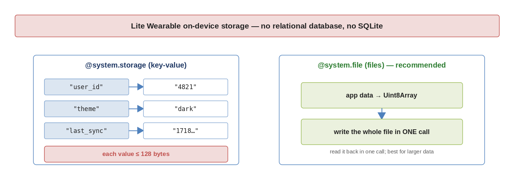

### Routing: `@ohos.router`

Page navigation. You move between pages with `router.push` (open a new page) and `router.replace` (open a new page and drop the current one). You go back with `router.back`.

    import router from '@ohos.router';

You pass data to the next page with a `params` **object**. Put the page path in `uri` and your data in `params`:

    // source page
    router.push({
      uri: 'pages/detail/detail',
      params: { id: 42, title: 'Steps' }
    });

On Lite Wearable, the values in `params` arrive on the target page as page data. You read them with direct property access, for example `this.id` and `this.title`, inside the page object. Keep the data small: pass identifiers and short values, not large objects.

### Device and configuration: `@system.device`, `@system.configuration`

`@system.device` returns hardware and screen facts. **Do not call** `device.getInfo` **before the home page’s** `onShow`**.**

    import device from '@system.device';

    device.getInfo({
      success(data) {
        console.log('brand=' + data.brand + ' shape=' + data.screenShape);
      },
      fail(data, code) { console.log('fail ' + code); },
    });

The `success` callback receives a `DeviceResponse` object with these fields:

| Field           | Type   | Description                                             |
|-----------------|--------|---------------------------------------------------------|
| `brand`         | string | Device brand.                                           |
| `manufacturer`  | string | Device manufacturer.                                    |
| `model`         | string | Device model.                                           |
| `product`       | string | Product number.                                         |
| `language`      | string | System language.                                        |
| `region`        | string | System region.                                          |
| `windowWidth`   | number | Window width.                                           |
| `windowHeight`  | number | Window height.                                          |
| `screenDensity` | number | Screen density.                                         |
| `screenShape`   | string | Screen shape: `rect` (rectangular) or `circle` (round). |
| `apiVersion`    | number | API version.                                            |
| `deviceType`    | string | Device type.                                            |

The `screenShape` field is the runtime version of the round-screen media feature. It lets a layout adapt to round versus rectangular watches.

`@system.configuration` reads the application/system locale:

    import configuration from '@system.configuration';

    const localeInfo = configuration.getLocale();   // LocaleResponse
    console.info(localeInfo.language);              // e.g. "zh"

`LocaleResponse` exposes `language`, `countryOrRegion` (for example `CN`, `US`), and `dir` (`ltr`/`rtl`). These are the basis for picking `i18n/` resource sets and for laying out right-to-left text.

### Security and cryptography: HUKS (`@ohos.security.huks`)

On Lite Wearable, the practical cryptographic API is **HUKS, the universal keystore** (`@ohos.security.huks`). Two other options are very limited here. The older `@system.cipher` module is not used in practice on this platform. Of the `@ohos.security.cryptoFramework` module, only the message-digest (MD) and secure-random functions work reliably. For real key management and encryption, use HUKS.

HUKS generates a key, stores it by an alias inside a secure store, and runs each cryptographic operation without ever giving the raw key to the application. It covers symmetric encryption, asymmetric encryption, and message authentication codes (MAC). The common symmetric algorithm is AES:

| Type      | Algorithm | Mode     | Padding   | Key length      |
|-----------|-----------|----------|-----------|-----------------|
| Symmetric | AES       | CBC, ECB | NoPadding | 128 / 192 / 256 |

A HUKS operation has a clear shape. You build a list of key properties (algorithm, purpose, key size, mode, padding). You generate or import a key under an alias. Then you run a three-step session (`initSession`, `updateSession`, `finishSession`) to encrypt, decrypt, or sign. You write the steps in sequence; each one finishes before the next line runs.

    import huks from '@ohos.security.huks';

    // Properties for an AES-256 / CBC / NoPadding key.
    let properties = [
      { tag: huks.HuksTag.HUKS_TAG_ALGORITHM,  value: huks.HuksKeyAlg.HUKS_ALG_AES },
      { tag: huks.HuksTag.HUKS_TAG_KEY_SIZE,   value: huks.HuksKeySize.HUKS_AES_KEY_SIZE_256 },
      { tag: huks.HuksTag.HUKS_TAG_PURPOSE,    value: huks.HuksKeyPurpose.HUKS_KEY_PURPOSE_ENCRYPT |
                                                      huks.HuksKeyPurpose.HUKS_KEY_PURPOSE_DECRYPT },
      { tag: huks.HuksTag.HUKS_TAG_BLOCK_MODE, value: huks.HuksCipherMode.HUKS_MODE_CBC },
      { tag: huks.HuksTag.HUKS_TAG_PADDING,    value: huks.HuksKeyPadding.HUKS_PADDING_NONE },
    ];
    let options = { properties: properties, inData: new Uint8Array(0) };

    // Generate the key under an alias. The key stays inside the secure store.
    huks.generateKeyItem('myAesKey', options);

After the key exists, you encrypt and decrypt with an `initSession` → `updateSession` → `finishSession` sequence that names the same alias and passes the data as a `Uint8Array`. For the full algorithm list and complete session examples, see the Huawei Lite Wearable security guide.

### NFC card emulation: `cardEmulation` (FA model)

Lite Wearable supports Host Card Emulation (HCE) through the FA-model form of the card-emulation module. You import it by its module name, not the Connectivity Kit alias:

    import cardEmulation from '@ohos.nfc.cardEmulation';

Only Host Card Emulation (HCE) is supported on Lite Wearable. Check for it with `cardEmulation.hasHceCapability()`, which returns whether the device supports HCE. `cardEmulation.isDefaultService(appName, type)` checks whether the app is the default for a `CardType` (`PAYMENT` or `OTHER`). HCE itself runs through an `HceService` instance:

| Member     | FA-model signature               | Purpose                                                                                  |
|------------|----------------------------------|------------------------------------------------------------------------------------------|
| `start`    | `start(elementName, aidList)`    | Bring the app to the foreground and register the AID list. Call in `onReady`.            |
| `on`       | `on('hceCmd', callback)`         | Subscribe to APDUs from the reader. The callback receives a `number[]` (each 0x00–0xFF). |
| `transmit` | `transmit(response[, callback])` | Send a response APDU back to the reader (promise or callback).                           |
| `off`      | `off('hceCmd', callback?)`       | Unsubscribe (API 18+).                                                                   |
| `stop`     | `stop(elementName)`              | Release the AID list and leave the foreground. Call in `onDestroy`.                      |

You declare the HCE-related NFC attributes in `module.json5`. For Lite Wearable, the FA-model block uses `metaData.customizeData` AID entries (`paymentAid`, `otherAid`) and the FA-model `reqPermissions` form:

    {
      "module": {
        "abilities": [
          {
            "metaData": {
              "customizeData": [
                { "name": "paymentAid", "value": "A0000000041012" },
                { "name": "otherAid",   "value": "A0000000041010" }
              ]
            },
            "skills": [
              {
                "entities": ["ohos.nfc.cardemulation.action.HOST_APDU_SERVICE"],
                "actions":  ["ohos.nfc.cardemulation.action.HOST_APDU_SERVICE"]
              }
            ]
          }
        ],
        "reqPermissions": [
          { "name": "ohos.permission.NFC_CARD_EMULATION", "reason": "$string:card_emulation_reason",
            "usedScene": { "ability": ["FormAbility"], "when": "always" } },
          { "name": "ohos.permission.NFC_TAG", "reason": "$string:card_emulation_reason",
            "usedScene": { "ability": ["FormAbility"], "when": "always" } }
        ]
      }
    }

A complete Lite Wearable HCE page wires the service into the page lifecycle:

    // xxx.js (lite wearable)
    import cardEmulation from '@ohos.nfc.cardEmulation';

    let appName = "com.example.testquestionlite";

    export default {
      data: {
        paymentAid: ["A0000000041010", "A0000000041012"]
      },
      onReady() {
        cardEmulation.hasHceCapability();
        cardEmulation.isDefaultService(appName, cardEmulation.CardType.PAYMENT);
        let hceService = new cardEmulation.HceService();
        hceService.start(appName, this.paymentAid);
        hceService.on("hceCmd", (data) => {
          console.info('apdu:' + data);
          let responseData = [0x1, 0x2];               // application-defined response
          hceService.transmit(responseData, () => {
            console.info('sendResponse start');
          });
        });
      },
      onDestroy() { }
    }

> **NOTE**, The `actions`/`entities` value `ohos.nfc.cardemulation.action.HOST_APDU_SERVICE` is fixed and must not be changed. AID names must be `paymentAid`/`otherAid` (FA model) in `customizeData`, and the permission name `ohos.permission.NFC_CARD_EMULATION` is fixed.

### Screen lock: `@ohos.screenLock` (FA-applicable methods)

The screen-lock module is deprecated since API 9 **except for lite wearables**, where it is still current. The FA-applicable methods read the lock state and request an unlock. Each comes in callback and promise forms.

    import screenLock from '@ohos.screenLock';

| Method           | Signatures                                                          | Purpose                                            |
|------------------|---------------------------------------------------------------------|----------------------------------------------------|
| `isScreenLocked` | `(callback: AsyncCallback<boolean>): void` / `(): Promise<boolean>` | Whether the screen is locked.                      |
| `isSecureMode`   | `(callback: AsyncCallback<boolean>): void` / `(): Promise<boolean>` | Whether the device requires credentials to unlock. |
| `unlockScreen`   | `(callback: AsyncCallback<void>): void` / `(): Promise<void>`       | Request an unlock.                                 |

    screenLock.isScreenLocked().then((locked) => {
      console.info('locked=' + locked);
    }).catch((err) => {
      console.error(`code ${err.code}: ${err.message}`);
    });

> **Note.** The screen-lock methods listed above are the ones that stay valid for Lite Wearable.

## 3.11 P2P Communication

A key use case of a Lite Wearable device is **off-board communication**. The watch pairs with a companion phone or a peer device to exchange data, hand off heavy work, and sync state. On Huawei wearables this comes through the **Wear Engine** and the cross-device peer-to-peer (P2P) channel. The wearable app opens a channel to a paired phone app, sends and receives messages and files, and reacts to connection-state changes.

This section will cover, for the Lite Wearable FA model:

- How to set up and tear down a P2P channel between the wearable app and a paired phone app.
- How to send and receive messages and binary payloads over the channel.
- The connection lifecycle and state-change handling, and how it maps onto the page lifecycle of section 3.7.
- The permission and pairing prerequisites, and how to declare them in `config.json`.

The open-source OpenHarmony mirror used in the rest of this chapter does **not** document Wear Engine or Huawei’s cross-device P2P API. These are Huawei-specific additions with no equivalent in the public `system.*` surface. So method signatures, channel-setup sequences, and code examples for this section cannot come from the current research set.

> **Wear Engine.** Cross-device communication between a Lite Wearable and a paired phone comes through Wear Engine. It requires the matching Wear Engine permission, declared during pre-development. Huawei documents the full Wear Engine API set separately, and you should consult it when you implement P2P features.

**Figure 10.** Wearable-to-phone communication is provided through Wear Engine, which requires the corresponding distributed-capability permission.

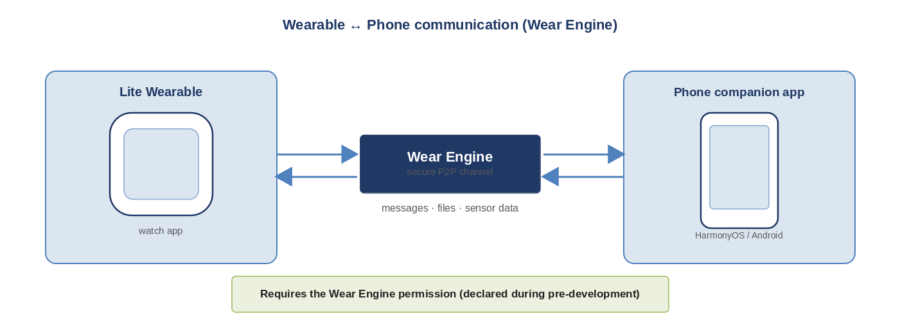

## 3.12 Platform-Specific Development Topics

The topics below are specific to the Lite Wearable form factor. They often trip up developers who come from phone or web development.

### 3.12.1 Multi-Language Localization (i18n)

Lite Wearable apps support several languages from a single build. You place resource files in the **i18n** folder. You name each file by **language-country/region**, for example `zh-CN.json` for Simplified Chinese or `en-US.json` for English. Lite Wearable supports only this language-country/region naming mode. The user does not choose the active language on the watch. It follows the **paired phone’s** language and region settings. For example, to show Traditional Chinese, the user sets the phone language to Traditional Chinese and the region to Hong Kong, which selects `zh-HK.json`. Some languages need more than one file. Indonesian, for instance, needs both `in-ID.json` and `id-ID.json`.

### 3.12.2 Crown (Rotating Bezel) Events

On watches with a rotating crown, crown rotation produces real-time input. Only the **List**, **Slider**, and **Swiper** components respond to the crown. To use it, activate focus in the page’s **onShow()** callback and set one of those components as the focused element. Release the focus when the page is switched away or the interaction is no longer needed.

### 3.12.3 Using Percentages for Layout

Since API version 5, the layout fields **width**, **height**, **margin**, **top**, and **left** accept percentage values as well as fixed pixels. The framework converts percentages to pixels at runtime. This helps a single layout adapt across the different screen sizes and shapes of the wearable line-up.

### 3.12.4 Adapting to a Square Watch

You handle round and square watches by giving the square form its own module. In DevEco Studio, create a new module (**New \> Module**) and copy the entry content into it. Then, in that module’s `config.json`, set `deviceType` to `liteWearable` and add a `distroFilter` whose `screenShape` policy includes the square form (for example, a 408 × 480 square watch).

### 3.12.5 Exiting the Application

A Lite Wearable app exits in response to a gesture or hardware button, not a system back stack. A common pattern binds the **onswipe** event to the outermost container. In the handler (`touchMove()`), it calls the app module’s `terminate()` when the user swipes in the chosen direction (for example, a rightward swipe). You must specify the swipe direction so that only the intended gesture exits the app.

# 4 Testing

Testing a Lite Wearable application is different from testing a web or mobile application. There are two main reasons. First, the app runs on a small, controlled device. A build can only run where its provisioning profile allows it. Second, you debug with Huawei’s tools. You use DevEco Studio and the DevEco Assistant, not a normal browser console. This chapter explains the toolchain and the end-to-end (E2E) debugging workflow.

## 4.1 The Testing Toolchain

As shown in Chapter 2, two tools work together during testing:

**DevEco Studio** runs the build, sign, and deploy pipeline. It compiles the FA-model project. It signs the package with the keystore and debug profile. Then it pushes the package to a connected device or to the previewer/simulator.

**DevEco Assistant** is the bridge to the physical wearable. It manages device pairing and the connection state. It shows device information, such as the model, the system version, and the UDID needed for the debug profile. It also streams logs and debug events back to you during a session.

The first-time setup has a few steps. You install both tools (Chapter 2.4). You pair the wearable through the Assistant. You confirm that the device UDID is in the active debug provisioning profile. You also check that DevEco Studio sees the connected device as a deployment target.

Two facts shape this setup. First, a **Lite Wearable cannot connect to DevEco Studio directly**. Sport watches, such as the GT/FIT series, have **no Wi-Fi debugging option**. So you debug through phone-side tools, not a direct link from the IDE to the device. The bridge is a Huawei phone running the latest **Huawei Health** app and the **HUAWEI DevEco Assistant** app. The phone must use a system version earlier than HarmonyOS 5. With these tools ready and the app manually signed (Chapter 2), the wearable can receive and run builds.

## 4.2 The Previewer and the Device Simulator

You can build much of a Lite Wearable UI in the DevEco Studio previewer/simulator. It renders HML/CSS/JS without a physical device. The simulator makes the edit-and-refresh loop faster. But it does not copy on-device behavior exactly. Some features behave differently or do not work in the simulator. These include certain `system.*` services, sensors, NFC card emulation, Wear Engine communication, and real resource and timing limits. The simulator also does **not** enforce the device’s memory limit: the JavaScript runtime on a real Lite Wearable has a budget of about **48 KB**, and going past it crashes the app, but the previewer will not show this. So a build that runs fine in the simulator can still crash on the watch from memory overflow. The previewer is best for fast work on layout, styling, and navigation. Always test anything that depends on real hardware, the 48 KB memory limit, or the paired-phone bridge on a real device before release.

## 4.3 End-to-End Debugging via DevEco Assistant

The deployment loop is manual and concrete. You reach the wearable through the paired phone, not a direct IDE connection:

1.  **Build**: in DevEco Studio, build the FA-model project. The HAP is created under **Build \> outputs \> hap** in the project folder.
2.  **Sign**: the wearable cannot be auto-signed. Make sure the HAP is **manually signed** with a profile that includes the device UDID (Chapter 2).
3.  **Connect**: connect the Huawei phone to the PC over USB. Choose **Transfer files** on the phone.
4.  **Deploy**: copy the signed HAP to the phone’s **/sdcard/haps/** directory. With the Huawei Health and DevEco Assistant apps, it installs and launches on the paired wearable.
5.  **Observe**: the application and page lifecycle callbacks fire on the device (`onCreate`/`onShow`/`onHide`/`onDestroy`, and page `onInit`/`onReady`). Use the **HUAWEI DevEco Assistant** app to debug the watch and to read logs and errors. There is no Wi-Fi debugging.
6.  **Iterate**: fix, rebuild, re-sign, and redeploy.

Good debugging needs clear logging in the JS layer. Use the universal and kit error codes in Chapter 5 to understand failures. Use the SysCap and `canIUse` checks from Chapter 1 to confirm that a capability exists on the device before you call it.

**Figure 11.** The end-to-end debugging loop: connect through DevEco Assistant, then build, sign, deploy, and observe with DevEco Studio, iterating on each change.

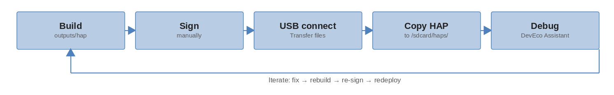

## 4.4 Pre-Release Verification

Test on real hardware before you call a build ready. Confirm that the app installs with the release signing path, not just the debug one. Check every screen and every lifecycle transition. Verify capability-gated features against `canIUse`. Confirm that the app handles the error codes in Chapter 5 well. Lite Wearable resources are limited. So pay close attention to memory, rendering performance, and behavior when the app moves between background and foreground.

# 5 Error Codes

This chapter explains how errors appear in the Lite Wearable JavaScript API. It gives reference tables for the error codes you will most often meet. Lite Wearable apps use the FA (Feature Ability) model. They call the `system.*` (web-like JS) API. So all the guidance and examples in this chapter use the FA model and the JS runtime. Some APIs are marked “deprecated except for lite wearables” in other documents. On Lite Wearable devices, those APIs are still fully supported. Their error codes work as described here.

The codes in this chapter fall into three groups:

- **Universal error codes** (Section 5.2) are shared by the whole platform. Any API can report them.
- **Background-task codes do not apply** (Section 5.3). Lite Wearable has no background execution. So this group of error codes is out of scope. This is explained in the section.
- **Application installation error codes** (Section 5.4) come from the device package manager. They appear when you install a signed HAP on the watch.

DevEco Studio also shows build and signing messages. These are noted briefly at the end of Section 5.4. They come from Huawei’s own toolchain. Their exact codes change with each tool version.

## 5.1 Error Handling Model

The JS API reports errors in two ways. The right way to handle an error depends on whether the API is **synchronous** or **asynchronous**.

**Synchronous APIs.** These always report errors as thrown exceptions. Wrap the call in a `try-catch` block. Then check the caught object.

**Asynchronous APIs.** These can report an error in two ways. The first is a synchronous exception. This is usually a parameter-check failure, error code `401`. It is thrown before the async work starts. The second is an async failure. This arrives after the work finishes. The way the async failure arrives depends on your calling style:

| Calling style              | Synchronous error | Asynchronous error                                               |
|----------------------------|-------------------|------------------------------------------------------------------|
| `await` / `async`          | `try-catch`       | `try-catch`                                                      |
| Promise (`then` / `catch`) | `try-catch`       | `.catch()` method or the `onrejected` callback of `.then()`      |
| Callback                   | `try-catch`       | error argument passed to the callback (a `BusinessError` object) |

So a safe call to a Promise-style async API needs two guards. Use `try-catch` for the synchronous `401`. Also add a `.catch()` for the rejection. The callback style still works. But it is not the best choice for new code.

**BusinessError objects.** When an error arrives through a callback, it comes as a `BusinessError` object. This object holds the numeric error code. The code matches the codes in this chapter. It also holds a readable message. So your handler can check `error.code`. Thrown synchronous exceptions carry the same code and message.

**FA-model JS example.** The code below is written for the FA model JS runtime. It shows both guards together. A `try-catch` guards the synchronous parameter-check exception. The Promise `catch()` method handles the rejection. The example uses a generic `system.*`-style async call.

    // FA model: page logic (e.g., in pages/index/index.js)
    export default {
      callApi() {
        try {
          // Asynchronous API using the Promise style.
          someModule.doAsyncWork({ param: 'value' })
            .then((result) => {
              console.log('Operation succeeded: ' + JSON.stringify(result));
            })
            .catch((error) => {
              // Asynchronous rejection: a BusinessError object.
              console.error('Async failed. code=' + error.code + ', message=' + error.message);
              // Branch on the numeric error code (see Sections 5.2 and 5.3).
              if (error.code === 801) {
                // Capability not supported on this device; fall back gracefully.
              }
            });
        } catch (exception) {
          // Synchronous exception (typically 401, parameter check failed).
          console.error('Sync threw. code=' + exception.code + ', message=' + exception.message);
        }
      }
    };

Always read `error.code` (or `exception.code`). Do not read the message text. The message can change between languages or versions. The numeric code stays the same.

## 5.2 Universal Error Codes

Universal error codes are not tied to one module. Any API can report them. The table below lists each code. It gives the name, the error message, the meaning, and what to do.

| Code  | Name                                                         | Error Message                                                                                                                                                                                                | Meaning                                                                                                                                                                                            | How to respond                                                                                                                                                 |
|-------|--------------------------------------------------------------|--------------------------------------------------------------------------------------------------------------------------------------------------------------------------------------------------------------|----------------------------------------------------------------------------------------------------------------------------------------------------------------------------------------------------|----------------------------------------------------------------------------------------------------------------------------------------------------------------|
| `201` | Permission Denied                                            | Permission verification failed. The application does not have the permission required to call the API.                                                                                                       | The app called an API but did not have the permission that API needs.                                                                                                                              | Find the permission the API needs. Declare and request it. Make sure the app holds it before the call.                                                         |
| `202` | Permission Verification Failed for Calling a System API      | Permission verification failed. A non-system application calls a system API.                                                                                                                                 | A non-system app tried to call an API meant only for system apps.                                                                                                                                  | Check if you call any system API and remove it. Common apps must not call system APIs.                                                                         |
| `203` | System Function Prohibited by Enterprise Management Policies | This function is prohibited by enterprise management policies.                                                                                                                                               | A device-management (MDM) policy has turned off the system function you asked for.                                                                                                                 | Check if the function is turned off. Use the enterprise restriction query API. Turn it on again through the policy if that is allowed. If not, do not call it. |
| `204` | Access Denied by User Access Control Policy                  | Access denied due to user access control policy. Possible causes: 1. The operation is prohibited by OS-account constraints. 2. The required privilege for the operation has expired or has not been granted. | The action is blocked. Either an OS-account rule blocks it, or a needed privilege is missing or expired.                                                                                           | Check the OS-account rules and the privileges. If a rule blocks the action, stop. If a privilege is needed, request it. Continue only if it is granted.        |
| `401` | Parameter Check Failed                                       | Parameter error. Possible causes: 1. Mandatory parameters are left unspecified; 2. Incorrect parameter types; 3. Parameter verification failed.                                                              | A required parameter was missing, a parameter had the wrong type, the number of arguments was wrong, or a parameter check failed. This error is usually thrown synchronously, even for async APIs. | Pass all required parameters. Use valid types and the right number of arguments. Check the API’s parameter list to find the wrong one.                         |
| `801` | API Not Supported                                            | Capability not supported. Failed to call the API due to limited device capabilities.                                                                                                                         | The device shows the SysCap for the API. But it does not support this specific API.                                                                                                                | Do not call the API on this device. Add capability checks so the app still works on other device types.                                                        |

> **Note (Lite Wearable framing).** Lite Wearable devices have limited capabilities. So code `801` (“API Not Supported”) matters a lot here. An API may be shown through its SysCap and still be missing on a watch. Guard optional features with `canIUse`-style checks (see the SysCap chapter). Treat `801` as a normal, non-fatal result. Codes `202`, `203`, and `204` are about system apps, enterprise management, and OS-account control. They rarely happen in a normal third-party Lite Wearable app. They are listed here to be complete.

## 5.3 Background Task Error Codes Do Not Apply to Lite Wearable

The platform has a Background Task Management module. It has its own error-code ranges. These are continuous-task codes (9800001–9800007), transient-task codes (9900001–9900004), and efficiency or energy-resource codes (18700001–18700004). **These do not apply to Lite Wearable.**

Lite Wearable devices do not support background tasks. The module is not on the device. So a Lite Wearable app will not call these APIs. It will not meet their error codes. Do not design around background execution. All work must finish while the app is in the foreground. Save your state (see Chapter 6). Then you can restore it when the user opens the app again. The most common mistake is to move phone or tablet background-task logic to a Lite Wearable. The right fix is to remove the need for background execution. Do not try to handle these error codes.

> **Note:** The background-task error codes are listed above only to show they are out of scope for Lite Wearable. The full list is in the platform-wide reference, for devices that do support background tasks.

## 5.4 Application Installation Error Codes

You install a signed HAP on a Lite Wearable by copying it to the device through the paired phone. The device package manager may reject it. It returns one of a few installation error codes. These are different from the runtime API codes in Sections 5.1–5.2. They appear at install time. They are not thrown to JavaScript. The most common ones are below.

| Code | Meaning                         | Common causes and resolution                                                                                                                                                                                                                                                         |
|------|---------------------------------|--------------------------------------------------------------------------------------------------------------------------------------------------------------------------------------------------------------------------------------------------------------------------------------|
| `40` | Configuration file format error | Check the `compileSdkVersion`. Make sure the `label` resource name in `config.json` (for example `"$string:squarewatch_MainAbility"`) is **no longer than 22 characters**. Make sure the app icon is a valid size: normally **80 × 80** or **114 × 114**.                            |
| `31` | Signature verification error    | Make sure the device **UDID has been added to the signature** (register the device first). Make sure the number of registered UDIDs **does not exceed 10**. Make sure the signing **certificate has not expired**. Remember that Lite Wearable needs **manual signing** (Chapter 2). |
| `47` | Invalid `app.apiVersion` field  | The vendor’s `compatibleSdkVersion` is set too high. Set `compatibleSdkVersion` **to 3** in the build configuration.                                                                                                                                                                 |
| `34` | Internal error                  | A general internal failure. Try the install again. If it keeps failing, rebuild the package.                                                                                                                                                                                         |

> **Note on toolchain diagnostics.** DevEco Studio shows build and signing messages. These cover compile failures, certificate or provisioning-profile problems, and HAP-generation errors. They come from Huawei’s own toolchain, not from the `system.*` API. Their exact codes change with each tool version. The device-side installation codes above are the ones a Lite Wearable developer most often needs to read.

# 6 Best Practices for Lite Wearable Development

A Lite Wearable is a focused platform, tuned for long battery life and a smooth, responsive experience on small hardware. Working with that focus (rather than against it) is what makes an app fast, stable, and pleasant to use. The earlier chapters described the platform’s shape: a compact ES6 subset, lightweight file-based storage, foreground-first execution, and a small CPU and memory budget. This chapter turns that shape into clear, practical advice you can apply right away. The guidance brings together Huawei’s official Lite Wearable best practices and lessons shared by developers building real apps. The main sources are listed at the end of the chapter.

## 6.1 The Core Mindset: Do Less, Use Less

On a small device, good code is not about clever tricks. It is about a steady habit of using less. Four ideas guide this habit. First, save CPU work. Use simple algorithms. Cache results instead of computing them again. Second, use less memory. Set up buffers once and reuse them. Do not create many short-lived objects. Memory is a hard limit here: the JavaScript runtime has a budget of about **48 KB**, and going past it crashes the app. Keep your live data and buffers small and well under this line. Third, ease the work of the garbage collector. A steady flow of temporary objects forces it to run, and each run pauses your app. Fourth, do less I/O. Group your reads and writes together. Do not send many small operations. These are not rules to memorize. They are a way of thinking. On a wearable, every allocation and every CPU cycle has a real cost.

## 6.2 Working With the JavaScript Engine

The runtime is a light engine. It supports only the ES6 subset described in section 3.7. So “modern JavaScript” is often the wrong choice on hot paths. Chains like `map`, `filter`, and `reduce` are easy to read. But they create extra arrays and add work for the garbage collector. For loops that must be fast, use a plain `for` loop. It is safer and faster.

Strings cannot change. So `slice` and repeated concatenation make a new string at every step. When you parse text, it is often cheaper to work with character codes directly. Reuse (intern) strings you use often. For work with a lot of data, use binary types. An `ArrayBuffer` view like `Uint8Array` can change in place and needs no new allocation. Most standard functions take it directly. This includes file I/O and cryptography through HUKS. Treat `JSON.parse` and `JSON.stringify` as slow. For large or frequent data, write your own serializer that fits the shape of your data. This avoids the overhead.

Here is a simple way to hold the idea in mind. Generic solutions work, but specific problems deserve specific fixes. When you understand the problem, you often find a much cheaper path. For example, keep a running sum instead of computing full-array statistics each time. Or use a single comparison instead of a pairwise scan, when the domain guarantees that only one case can happen.

## 6.3 Data Storage Strategy

Storage is where the Lite Wearable limits hit first. The familiar tools are simply not there. A Lite Wearable has **no relational database and no SQLite**. There is a key-value store, but each value has a hard limit of **128 bytes**. This is too small for anything but tiny pieces of state. You can split a larger payload across many keys and read them back, but this is slow and awkward. Avoid it.

The better way is file I/O. Convert your data to a `Uint8Array`. Write it to a file in one call. Read the whole file back in one call. This replaces many small key-value operations with one read and one write. It is faster and simpler. Note one more limit. String-based file writes are also size-limited, around 4 KB per call, so they need chunked appends. This is one more reason to use binary `ArrayBuffer` writes for anything large.

**Figure 12.** Data storage decision on Lite Wearable: with no relational database or SQLite, prefer single-call binary file I/O over the size-limited key-value store.

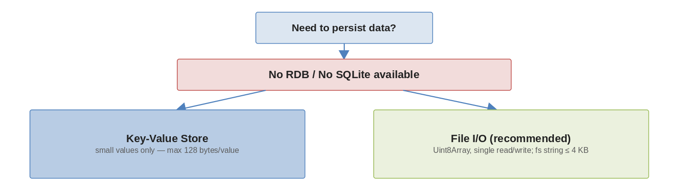

## 6.4 Code Organization

For any app that is not trivial, keep shared logic and styles in one place. Do not copy them across pages. Put common scripts and styles in the `common` directory. For example, use a `utils.js` for shared helpers and a `style.css` for shared rules. This keeps pages small. It gives the engine less code to parse. It also keeps behavior the same across the app. This follows the file-organization rules in section 3.4.

## 6.5 Foreground-Only Execution and State Persistence

As section 5.3 explained, Lite Wearable does not support background tasks. So your app must do its work while it is in the foreground. It must also save any important state, using the file-I/O method above. Then it can restore that state on the next launch. Lifecycle callbacks are the right place for this. Save on `onHide` and `onDestroy`. Restore on `onInit` and `onShow`. Do not try to keep work running after the app leaves the foreground.

## 6.6 Distributed and P2P Capabilities

A Lite Wearable talks to a paired phone through Wear Engine. Section 3.11 describes this. To use these distributed features, you must request the matching Wear Engine permission during pre-development setup. Keep cross-device exchanges rare and small. This follows the rule of using less. Each transfer costs power and processing on a device that has little of either.

## 6.7 Network Request Constraints

Network requests on a Lite Wearable have tight limits. If you go past them, the `fetch` fails completely. It does not slow down gracefully. Keep the **request header under 2 KB**. Keep any **single transport-layer packet under 7 KB**. If a request fails, the first thing to try is a smaller payload. Watch for platform limits too. A WATCH GT 5 or earlier, paired with an iPhone, cannot start `fetch` requests. Treat the network as scarce and unreliable. Batch and compress where you can. Always handle a failed request as a normal path, not a surprise.

> **Important: Europe.** On sport watches sold in Europe, network requests are **turned off**: a Lite Wearable app there **cannot start** `fetch` **requests at all**. If your app must support European devices, do not depend on direct network calls from the watch. Design it to work offline, or route data through the paired phone over Wear Engine (Section 3.11) instead of the watch’s own network.

## 6.8 References

This chapter draws on the following primary sources. Consult them for the most current and complete guidance.

- Huawei Developer, *Lite Wearable Applications Development Guide* (best practices): https://developer.huawei.com/consumer/en/doc/best-practices/bpta-lite-wearable-guide
- *Performance Tips and Techniques for Huawei Lite Wearable Devices*, HarmonyOS Developer community (DEV Community), 2025: https://dev.to/harmonyos/performance-tips-and-techniques-for-huawei-lite-wearable-devices-2931
- HarmonyOS Device, *Lite Wearable Overview*: https://device.harmonyos.com/en/docs/apiref/doc-guides/lite-wearable-overview-0000001197577411

The specific advice in this chapter comes straight from those sources. This covers the storage strategy, the synchronous behavior of asynchronous APIs, the network limits, and the localization, crown, percentage, square-watch, and exit patterns described in Chapter 3. All of it is drawn from Huawei’s official Lite Wearable best-practices guide and the community performance write-up cited above.
